# AWS Batch

## Setup
Original documentation here, but does not have screenshots for the AWS side:
[AWS Lambda for sending CloudWatch logs | New Relic Documentation](https://docs.newrelic.com/docs/logs/forward-logs/aws-lambda-sending-cloudwatch-logs/)

1. Log into your AWS Console as an administrator, or someone with roles to create IAM roles and lambda triggers.
2. Go to https://serverlessrepo.aws.amazon.com/applications
3. Search for "newrelic" and click on **NewRelic-log-ingestion**
   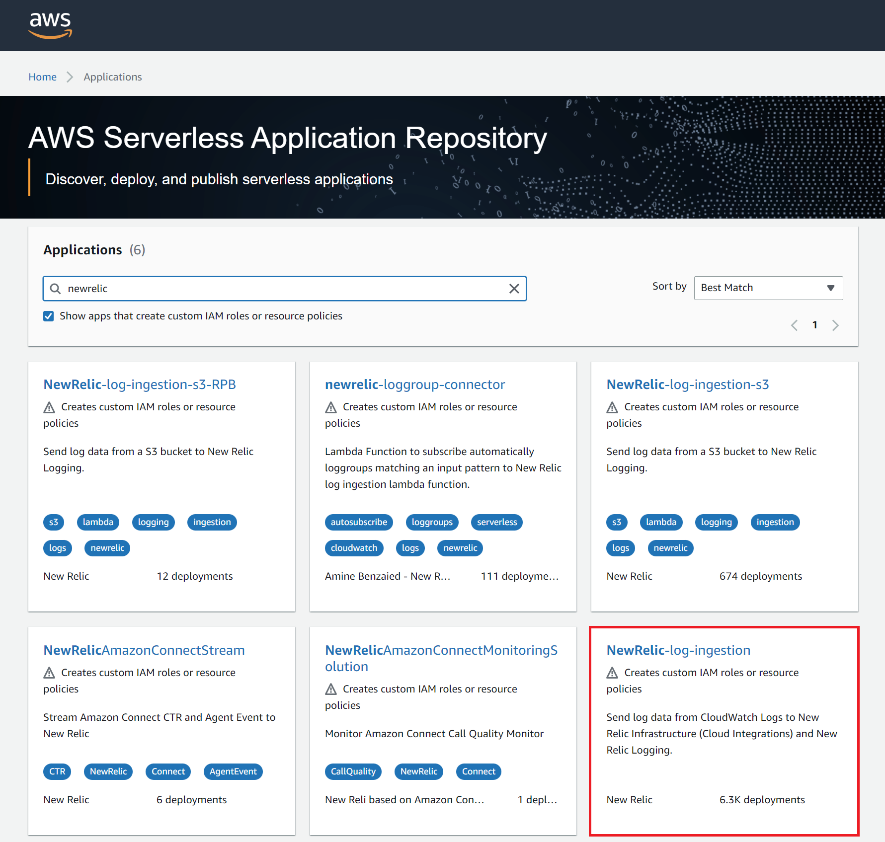

4. Click "Deploy" on the top-right
   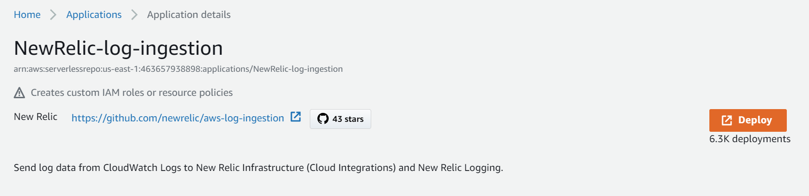

5. Fill in the following fields (case sensitive)
    | Field | Setting |
    | --- | --- |
    | Application name | NewRelic-log-ingestion (default) |
    | DebugLoggingEnabled | True |
    | NRInfraLogging | True |
    | NRLicenseKey | XXXXXXXXXXXXXXXXXXXXXXXXXXXXXNRAL |
    | NRLoggingEnabled | True |
   
   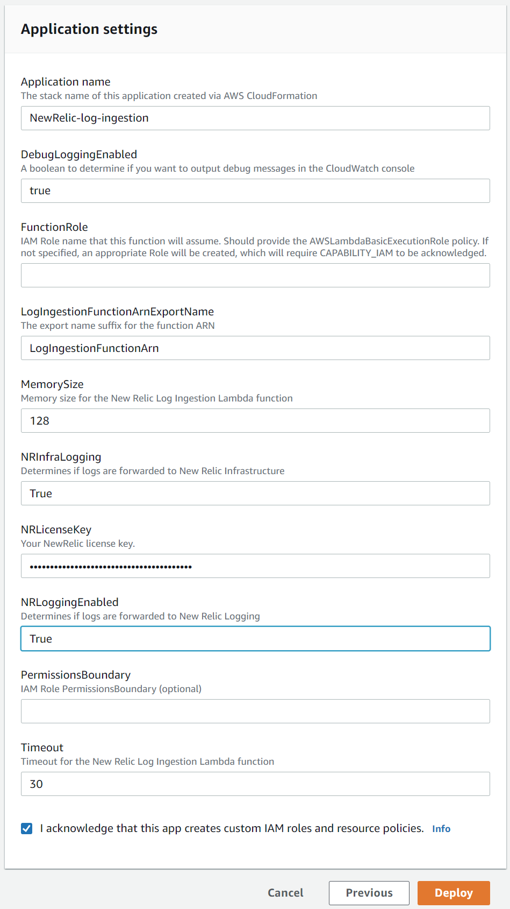


6. Click "Deploy".
7. Once deployed, click on "Functions" under AWS Lambda and select the function you just created.
   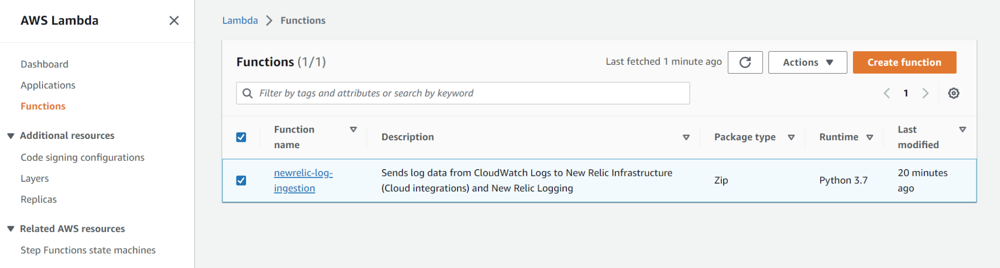


8. Under "Function overview", click on the "Add trigger" button on the left.
  i. Select source: CloudWatch Logs
  ii. Select Log group.  In this example /aws/batch/job was selected
  iii. Enter a filter name.  In this example awsBatchLogs was used.
    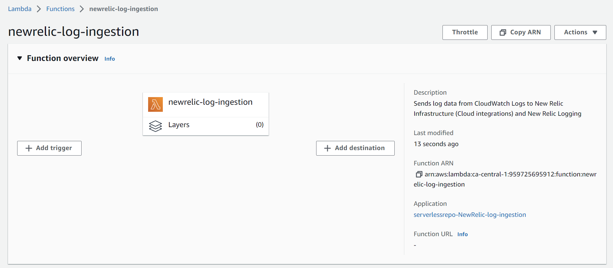

9. Click "Add"  
  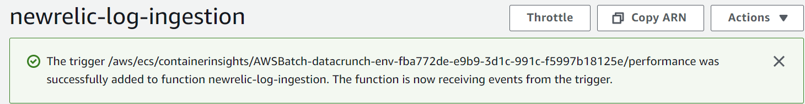

10. Continue to add more triggers until all of the log groups required are added
    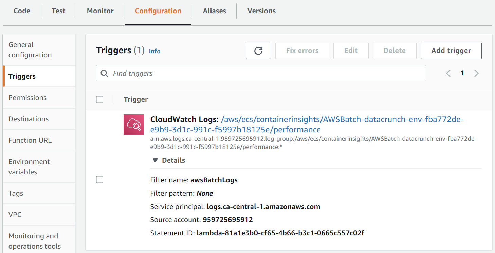


## Troubleshooting

Run some AWS batch jobs to generate logs.  In this example, the job runs, but fails, and logs can be seen under Job logs at the bottom.
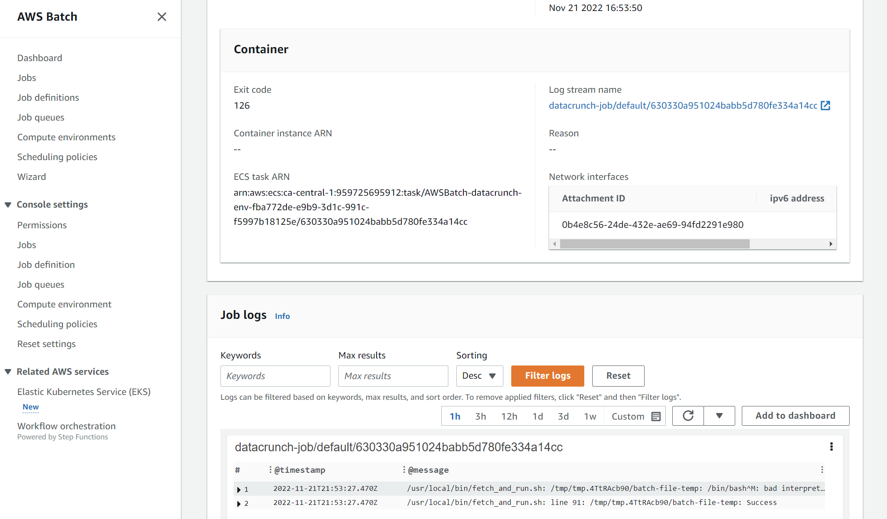

These logs should also be under CloudWatch to view
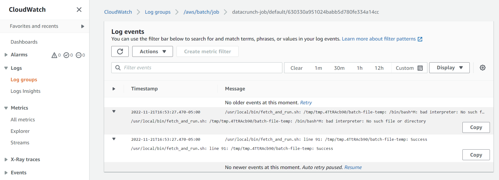

Finally, check New Relic logs
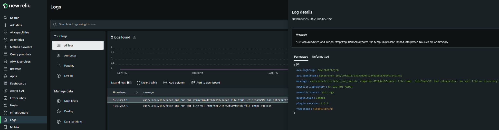

To find these logs with NRQL (replace with your own log group name):
```NRQL
SELECT * FROM Log WHERE aws.logGroup='/aws/batch/job'
```
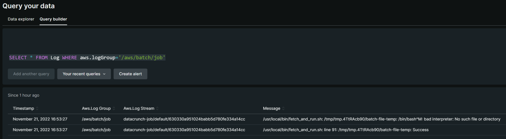

You can also create time series charts with this data
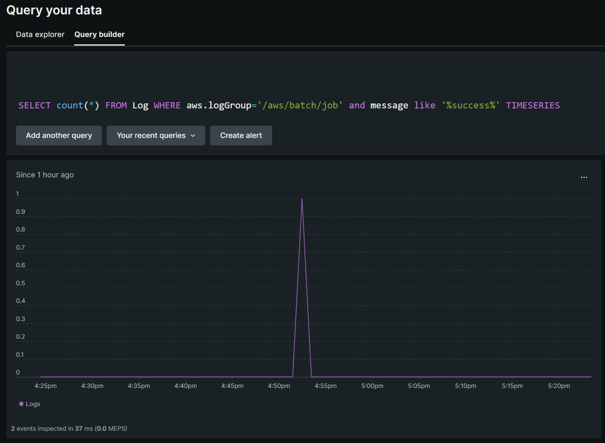

### AWS Batch Job is failing and I don't see logs?
Check IAM role to make sure to add permissions to create log streams:
https://docs.aws.amazon.com/batch/latest/userguide/execution-IAM-role.html
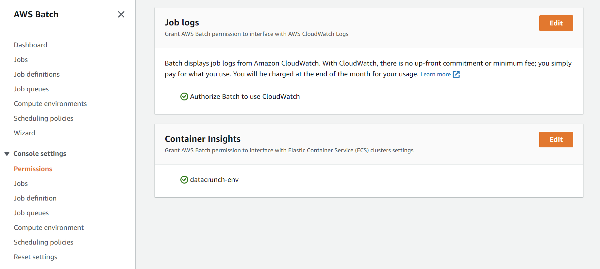


### AWS Batch Job is still failing?!  
Depending on how your AWS Batch job was created, you may need the following permissions:
* AmazonECSTaskExecutionRolePolicy (pulling images from ECR)
* AmazonS3ReadOnlyAccess (getting script files from S3 bucket)

Permissions and roles are good, but it's still broken?!
Check your AWS Batch Job definitions.  If you are pulling docker images from a public registry, be sure to set Assign public IP to ENABLED.


There's no Logs in CloudWatch!
When creating a Job Definition, be sure to select `awslogs` as the log driver
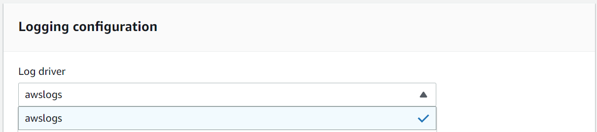

