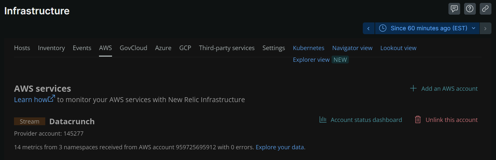

# Amazon CloudWatch Metric Streams


## Documentation
Here's the official documentation: 
[Set up the Amazon CloudWatch Metric Streams integration | New Relic Documentation](https://docs.newrelic.com/docs/infrastructure/amazon-integrations/connect/aws-metric-stream-setup)

However, it does not cover what you need to do on the AWS Console.  This guide goes over what to do on the AWS side.  

Note: Screenshots from AWS console may change and may not match what is shown here.

## Create Role

Log into your AWS Console and go to **IAM** > **Roles** and click on "Create Role" button


## Select trusted entity

1. Select "AWS account"
2. Under "An AWS account", select "Another AWS account" and enter Account ID: **754728514883** (as seen in the New Relic Guide)
3. Check "Require external ID" and enter External ID: **3293157**
4. Click "Next"


## Add permissions
Search for "**ReadOnlyAccess**" and press Enter to add this filter.  Check this option and click "Next" on the bottom-right.

Tip: Sort "Policy name" in descending order to quickly find the AWS managed **ReadOnlyAccess** role on the first page.


## Name, review, and create
Give the role a memorable name.  In this example "*nr1-metricstreams*" is used.


Optionally, add tags (such as team:<your-team>), then click pon "Create role" on the bottom-right.


Wait for the role to be created, this took about 1 minute:  
  


## Create inline policy

Click on the newly created role


Click on "Add permissions" and select "Create inline policy"


Click on JSON and paste in the following

```json
{
  "Statement": [
    {
      "Action": [
        "budgets:ViewBudget"
      ],
      "Effect": "Allow",
      "Resource": "*"
    }
  ],
  "Version": "2012-10-17"
}
```


Click on "Review policy" on the bottom-right.


## Review Policy

Give the in-line policy a name.  In this example, we use "nr1-budget".  Then click "Create policy" on the bottom-right.


This new role should now look like this:
1. ReadOnlyAccess (AWS managed)
2. Nr1-budget (Customer inline)


Copy the ARN at the top.  We'll need to paste this into New Relic.


In New Relic, go to Infrastructure > AWS > Metric Streams (Step 5).  Enter a name for the AWS account.  Then paste the ARN from the previous step, and click "Next".


## CloudFormation

Infrastructure > AWS > Metric Streams (Step 6): Click on "Use the CloudFormation Template".
https://console.aws.amazon.com/cloudformation/home?#/stacks/quickcreate?templateURL=https://nr-downloads-main.s3.amazonaws.com/cloud_integrations/aws/cloudformation/MetricStreams_CloudFormation.yml&stackName=NewRelic-Metric-Stream&param_NewRelicDatacenter=US

You can review the CloudFormation template here:
https://nr-downloads-main.s3.amazonaws.com/cloud_integrations/aws/cloudformation/MetricStreams_CloudFormation.yml

An AWS administrator would need to have permissions to create the following to proceed:
1. AWS::S3::Bucket
2. AWS::KinesisFirehose::DeliveryStream
3. AWS::IAM::Role
4. AWS::CloudWatch::MetricStream
5. AWS::Config::ConfigurationRecorder
6. AWS::Config::DeliveryChannel


You'll need the New Relic License - Ingest key (ending with NRAL).


Check "I acknowledge that AWS CloudFormation might create IAM resources with custom names" and click "Create stack".


Note: This should take about 5 minutes to complete


Here's what the resources should look like


Back in New Relic (Step 6), click "Done".  From here, wait for the data to populate in New Relic (may take another 5 minutes on initial setup).  Click on "Account status dashboard" on the top-right.


Alternatively, check for AWS metrics by going to: 
**Metrics & events** > **Metrics** and search for "aws".


In general, you can find the metric names according to AWS's documentation:
https://docs.aws.amazon.com/AmazonCloudWatch/latest/monitoring/aws-services-cloudwatch-metrics.html


Once you can confirm AWS metrics are showing up on New Relic, we can start creating custom dashboards.
