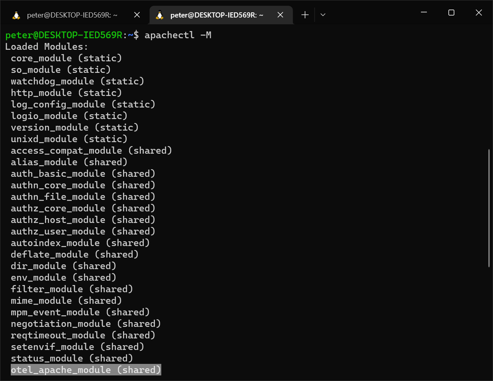
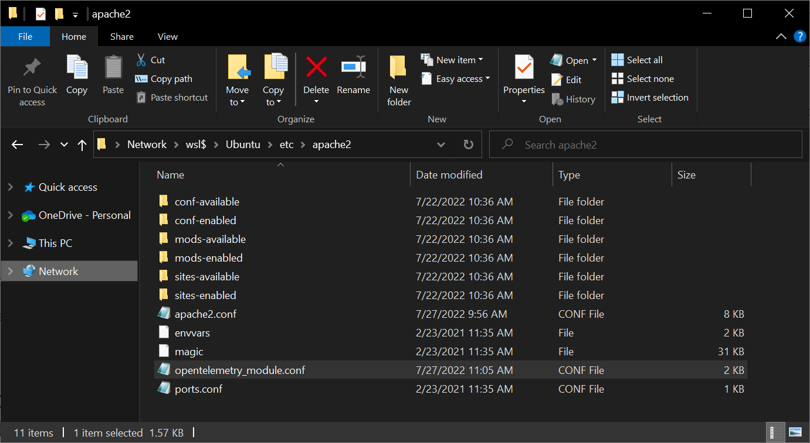
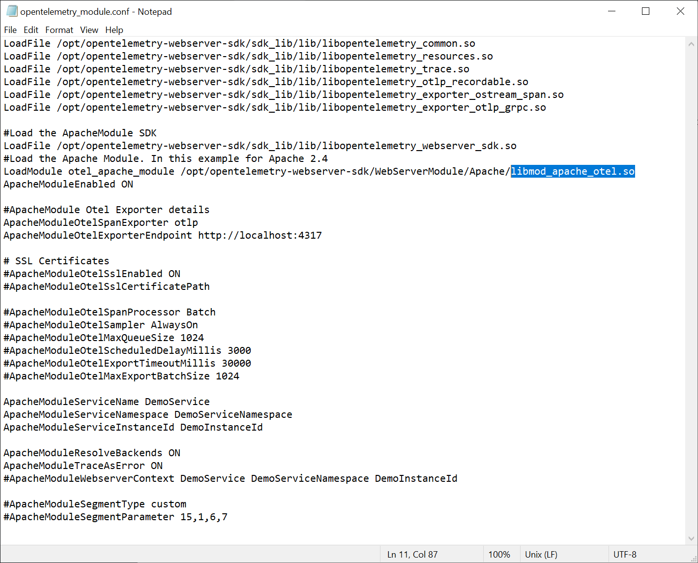
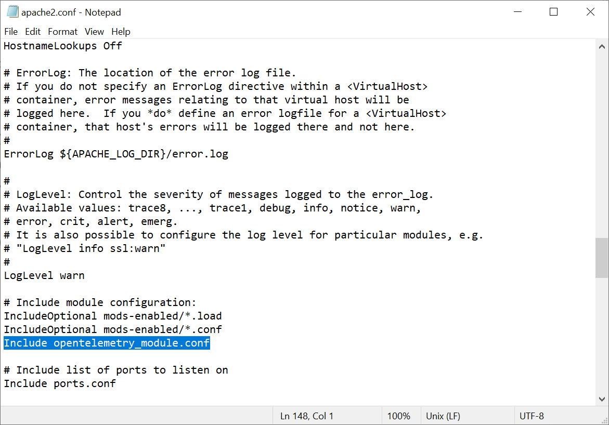
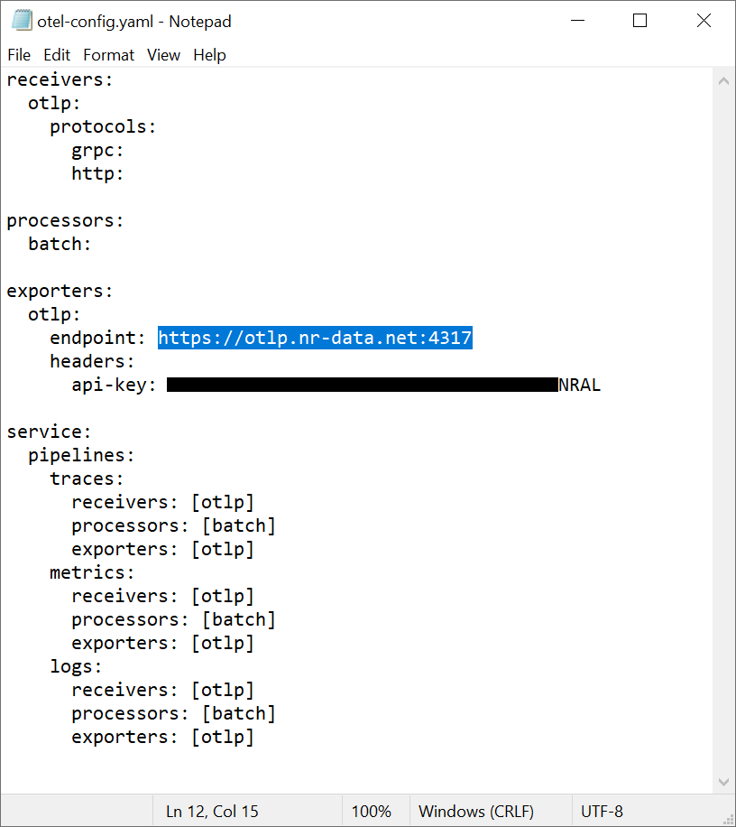
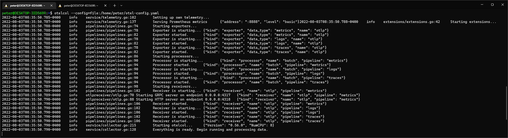
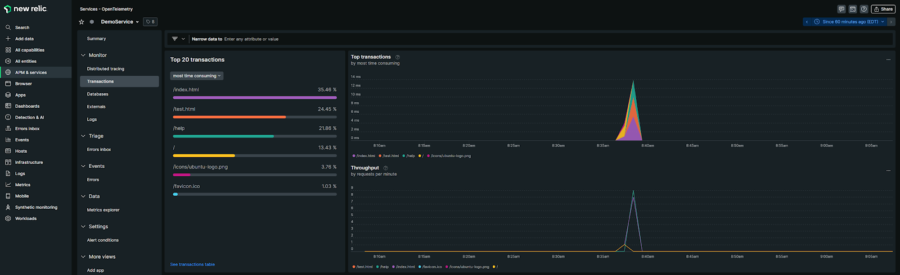

# Apache HTTP Server (httpd)

Check out the 25 minute video recording showing these steps using OpenTelemetry:  
https://drive.google.com/file/d/1j7B3572z-hH-kEC6EtMP50Bv-YjUzmUU/view?usp=sharing


```mermaid
flowchart LR

    subgraph apache2[Apache HTTP Server]
    http://localhost:80
    end

    subgraph otelcol[OpenTelemetry Collector]
    http://localhost:4317
    end

    subgraph newrelic[New Relic OTLP Endpoint]
    https://otlp.nr-data.net:4317
    end

    users-->apache2
    users-->apps
    apps-->apache2-->|opentelemetry_module.conf| otelcol--> |otel-config.yaml| newrelic
linkStyle default stroke:red
 ```

## Instructions

1. Download and extract `opentelemetry-webserver-sdk-x64-linux.tgz`:  
https://github.com/open-telemetry/opentelemetry-cpp-contrib/releases


2. Extract the package `opentelemetry-webserver-sdk-x64-linux.tgz` to the `/opt` directory:
   ```bash
   tar -xvf opentelemetry-webserver-sdk-x64-linux.tgz -C /opt
   ```

 
3. At this point the directory structure should like like this

    ```
    opt
    └───opentelemetry-webserver-sdk
        │   install.sh
        │   VERSION.txt
        │
        ├───conf
        │       appdynamics_sdk_log4cxx.xml.template
        │
        ├───logs
        ├───sdk_lib
        │   └───lib
        │           libopentelemetry_common.so
        │           libopentelemetry_exporter_ostream_span.so
        │           libopentelemetry_exporter_otlp_grpc.so
        │           libopentelemetry_otlp_recordable.so
        │           libopentelemetry_resources.so
        │           libopentelemetry_trace.so
        │           libopentelemetry_webserver_sdk.so
        │
        └───WebServerModule
            ├───Apache
            │   │   libmod_apache_otel.so
            │   │   libmod_apache_otel22.so
            │   │
            │   └───libopentelemetry_webserver_sdk.so
            └───Nginx
        ngx_http_opentelemetry_module.so
    ```


4. Install the module
    ```
    cd /opt/opentelemetry-webserver-sdk
    sudo ./install.sh
    ```

5. To confirm if the module has been installed correctly, use this command:
    ```
    apachectl -M
    ```

   Alternatively, depending on how your Apache web server was installed, use this:
    ```
    httpd -M
    ```
    

6. Depending on your operating system and how Apache web server was installed, the root of your Apache installation can be found at `/etc/apache2/` or `/etc/httpd/`. Make sure your web server is actually working by starting it up (apache2 or httpd)
    ```
    sudo service apache2 stop
    sudo service apache2 start
    ```

7. Download this to the root of your Apache install folder:  
   https://raw.githubusercontent.com/open-telemetry/opentelemetry-cpp-contrib/main/instrumentation/otel-webserver-module/opentelemetry_module.conf

   

8.  Edit the `opentelemetry_module.conf` file . We need to make three changes here.  
  - First, If you are running Apache 2.4, change line 11 to use `libmod_apache_otel.so` otherwise, don't change it if you are using Apache 2.2.
  - Second, change from `docker.for.mac.localhost:4317` to `http://localhost:4317` on line 16. 
  - Third, change `ApacheModuleServiceName`, `ApacheModuleServiceNamespace`, and `ApacheModuleServiceInstanceId`, which are named Demo*.  Service name is what shows up in New Relic, so you can call this whatever you want.  The Service Instance Id is normally your Apache server name so transactions can be organized by host.

  

9. Edit `/etc/apache2/apache2.conf` (or `/etc/httpd/conf/httpd.conf`) and add this line somewhere:
    ```
    Include opentelemetry_module.conf
    ```
  

10. Install the OpenTelemetry Collector by downloading the `otelcol` package from here:  
    https://github.com/open-telemetry/opentelemetry-collector-releases/releases/


11. Depending on your OS, you'll need to install this using something like this:
    ```
    sudo apt install ./otelcol_0.67.0_linux_amd64.deb
    ```

12. Create a new file called otel-config.yaml somewhere (`/opt/opentelemetry-webserver-sdk/`) and paste the config from this page:  
    https://docs.newrelic.com/docs/more-integrations/open-source-telemetry-integrations/opentelemetry/collector/opentelemetry-collector-basic/

13. Edit the `otel-config.yaml` file and change the api-key to your New Relic INGEST - LICENSE key and OpenTelemetry endpoint.  
  


14. Start the OpenTelemetry Collector with this command:
    ```
    otelcol --config=file:/opt/opentelemetry-webserver-sdk/otel-config.yaml
    ```
  

15. Finally, restart your Apache web server and generate some traffic by going to http://localhost


16. If everything works out, you should start seeing transaction data coming into New Relic under APM & Services > Services - OpenTelemetry after a few minutes.
  


## Dashboard
Coming soon.
 

