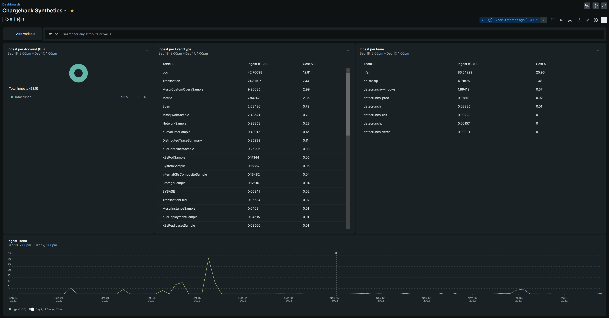

# Chargeback Script
This "chargeback" script schould be added as a Synthetic API script test to run **hourly**.  Before you continue, create a secure credential for the following:
1. `<api_key>` - Your User API key, preferrably from an account that can query account usage details (usually an admin).  If using a secure credential, this should look like `$secure.API_KEY`.
2. `<ingest_key>` - The Ingest - License key to get data into New Relic. If using a secure credential, this should look like `$secure.INGEST_KEY`
3. `<facet>` - If your entities in New Relic are tagged, use the tag name here to break out the results by tag.  For example, a typical tag used is `team` to breakdown the chargeback by teams.  If there are no tags in place, you can use `appName` for now.

[gist: ingest-granular-generic.js](https://gist.githubusercontent.com/khpeet/30d80fc70a2d842089a94a64b94f89bf/raw/7e0e03810f1f759f2ccc61fdb9103e05f08cc908/ingest-granular-generic.js ':include')

## Dashboard
Once the synthetic monitor is running the chargeback script, import the following dashboard.  Just besure to
1. Update the `"accountId": 0` to your account number
2. Edit each dashboard widget to enable the option to "Filter the current dashboard".

[gist: chargeback_synthetics.json](https://gist.githubusercontent.com/pnvnd/cb2cbb41f4422d0438c92ddc4ba1523e/raw/b62db382f9daa706ce4a5324aaa067e0913532eb/chargeback_synthetics.json ':include')

This script keeps your ingest data as metrics so you can go back up to 13 months of data, and filter by `account`, `eventType`, or any tag of your choice (`team` in this example).
