# IBM MQ Monitoring (Windows)

## Summary
At this time, New Relic IBM MQ monitoring solution is only supported in Linux.  This solution aims to be a temporary measure until Windows support is added.


## Instructions

```mermaid
flowchart TB

    subgraph mq_prometheus[Prometheus Exporter]
    http://localhost:9157
    http://localhost:9158
    end

    subgraph prometheus[Prometheus Server]
    http://localhost:9090
    end

    subgraph newrelic[New Relic Remote Write]
    https://metric-api.newrelic.com/prometheus/v1/write?prometheus_server=ibmmq-windows
    bearer_token=XXXXXXXXXXXXXXXXXXXXXXXXXXXXXXXXNRAL
    end

    mq_prometheus-->prometheus-->newrelic
 ```

### Prerequisites
1. You'll need your own instance of IBM MQ installed on Windows.  If you don't have one, follow the instructions here to get an IBM MQ instance for development on Windows: [IBM Developer](https://developer.ibm.com/tutorials/mq-connect-app-queue-manager-windows/#step-1-download-ibm-mq)

2. Set System Environment Variable: `MQ_ENABLE_METRICS=true`

3. Restart IBM MQ.  For example, `net stop MQ_Installation1 && net start MQ_Installation1`  
   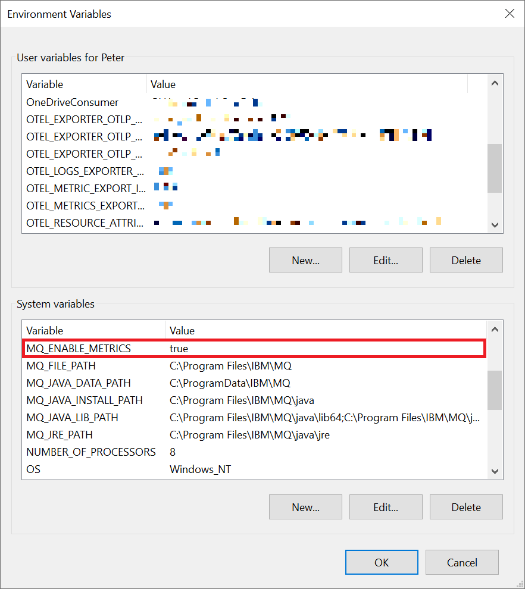


### Get the IBM MQ Prometheus Exporter
1. Download it from GitHub (unofficial binaries)  
   https://github.com/pnvnd/mq-metric-samples/releases


2. Otherwise, compile it yourself by installing `go`  
   https://golang.org/dl/


3. Install `tdm-gcc` (as per instructions on official IBM repository)
   https://jmeubank.github.io/tdm-gcc/download/


4. Clone the official repository from the IBM GitHub account somewhere on your computer  
    ```
    git clone https://github.com/ibm-messaging/mq-metric-samples.git c:\src
    ```
    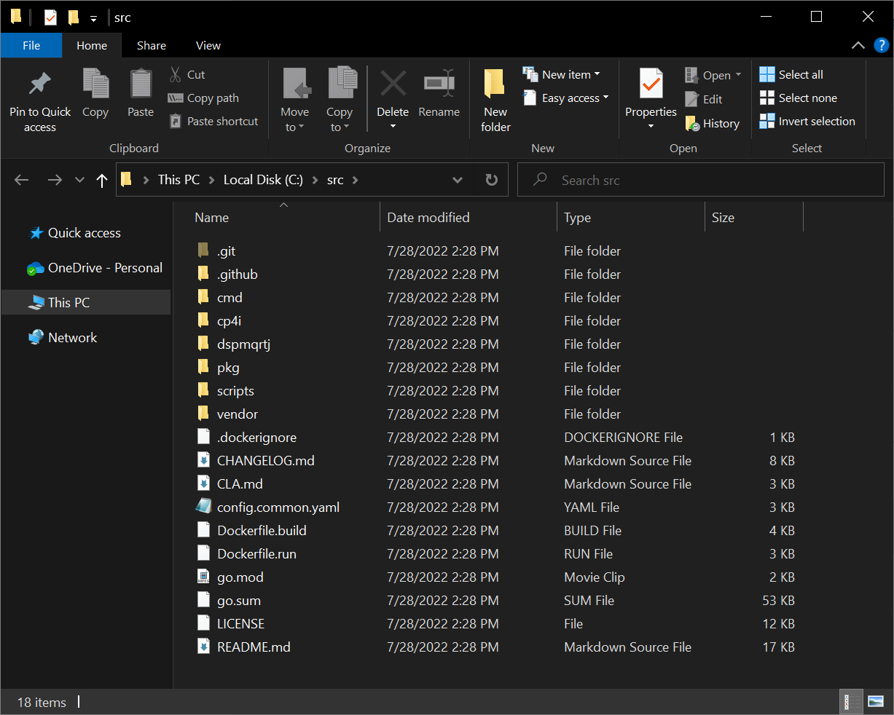

5. Change directory to the one containing the scripts for mq_prometheus
    ```
    cd c:/src/cmd/mq_prometheus
    ```
    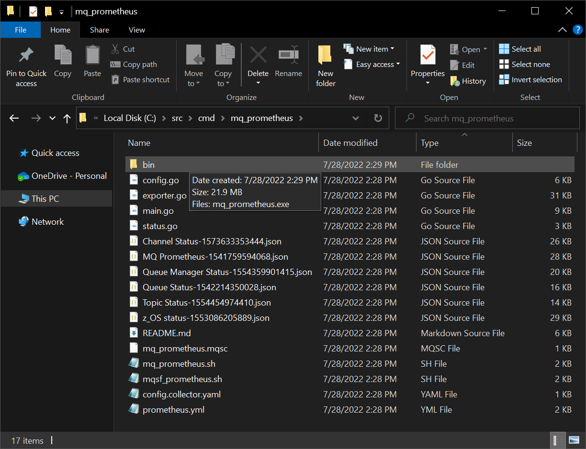

6. Run the following command
    ```
    go build -o ./bin/mq_prometheus.exe
    ```
    


7. The `C:\src\cmd\mq_prometheus\bin\mq_prometheus.exe` is what we'll need to continue.  To test this, make sure your IBM MQ service has started.  In this case, I can either start the service from `services.msc` or use `net start MQ_Installation1`.
   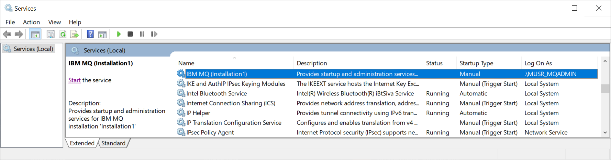


8. Next, make sure the queue manager is running.  In this case, I have two (2) queue managers named QM1 and QM2.  To start these two queue managers, I would need to use the following command
    ```
    strmqm QM1
    strmqm QM2
    ```
    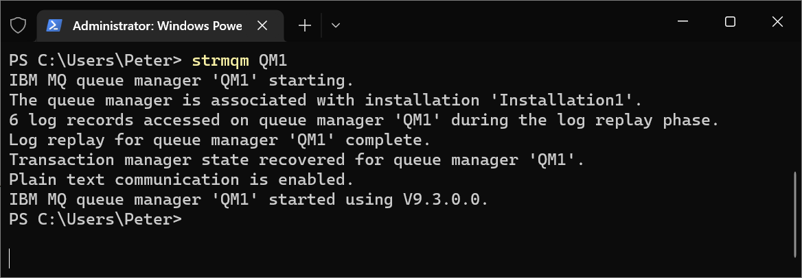

9. Note: `mq_exporter.exe` exports metrics from one queue manager to one port.  If you have multiple queue managers, you'll need to run this again for another queue manager on a different port.  Assuming I have two queue managers where I want QM1 metrics sent to port 9157 and QM2 metrics sent to port 9158, run these commands on separate terminals as an Administrator:
    ```
    mq_prometheus.exe 
    --ibmmq.queueManager "QM1" 
    --ibmmq.httpListenPort 9157 
    --ibmmq.monitoredQueues "!SYSTEM.*,*" 
    --ibmmq.monitoredChannels "*" 
    --ibmmq.monitoredTopics "*" 
    --ibmmq.monitoredSubscriptions "*" 
    --ibmmq.httpMetricPath "/metrics" 
    --ibmmq.useStatus

    mq_prometheus.exe 
    --ibmmq.queueManager "QM2" 
    --ibmmq.httpListenPort 9158 
    --ibmmq.monitoredQueues "!SYSTEM.*,*" 
    --ibmmq.monitoredChannels "*" 
    --ibmmq.monitoredTopics "*" 
    --ibmmq.monitoredSubscriptions "*" 
    --ibmmq.httpMetricPath "/metrics" 
    --ibmmq.useStatus
    ```
    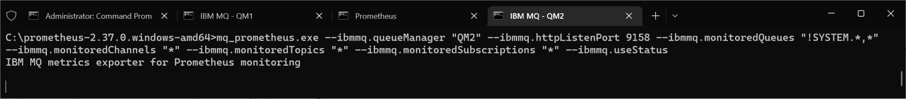


10. In some cases, depending on how your instance of IBM MQ permissions, or how  groups/roles is setup in Windows, you may also need the following flags in the command:
    ```
    --ibmmq.connName "localhost(1414)" 
    --ibmmq.channel "DEV.APP.SVRCONN" 
    --ibmmq.userid "app" 
    --ibmmq.password "passw0rd"
    ```

11. To check the metrics being exported, you can do the following with the COmmand Prompt
    ```
    curl localhost:9157/metrics
    curl localhost:9158/metrics
    ```

   Or with PowerShell
    ```
    Invoke-WebRequest -Uri http://localhost:9157/metrics | Select-Object -Expand Content
    Invoke-WebRequest -Uri http://localhost:9158/metrics | Select-Object -Expand Content
    ```
    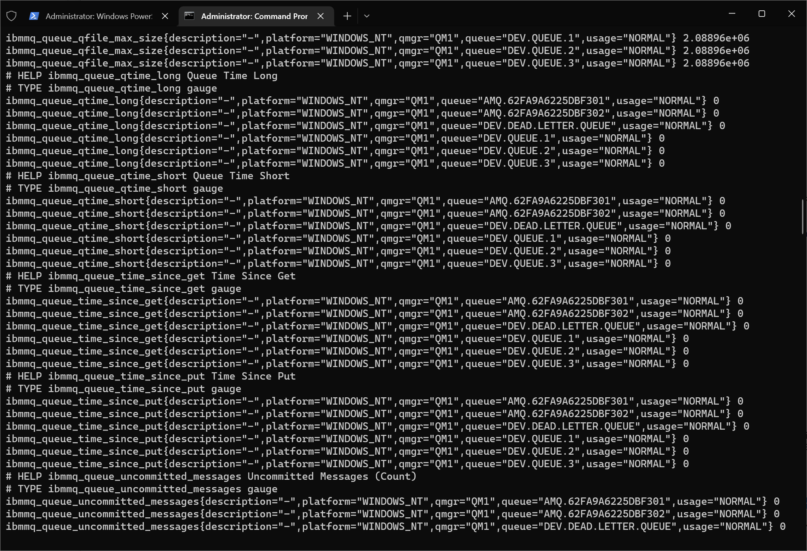

### Get Prometheus

1. Download Prometheus for Windows and get the .zip version  
   https://prometheus.io/download/


2. Extract the contents somewhere sensible, such as `C:\prometheus-2.37.0.windows-amd64` for this example


3. Copy `C:\src\cmd\mq_prometheus\bin\mq_prometheus.exe` to `C:\prometheus-2.37.0.windows-amd64` for this example.
   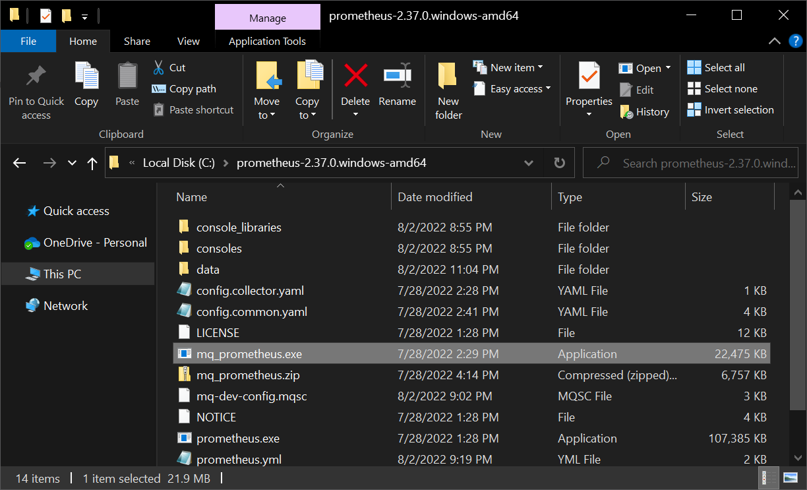

4. Copy `C:\src\cmd\mq_prometheus\prometheus.yml` to `C:\prometheus-2.37.0.windows-amd64` (you'll need to overwrite this file, since the yml file from the the official IBM repository does what we want)


5. Edit `prometheus.yml` line 39, assuming only one (1) Queue Manager
    ```
    - targets: ['localhost:9157']
    ```
    or for two Queue Managers
    ```
    - targets: ['localhost:9157','localhost:9158']
    ```
    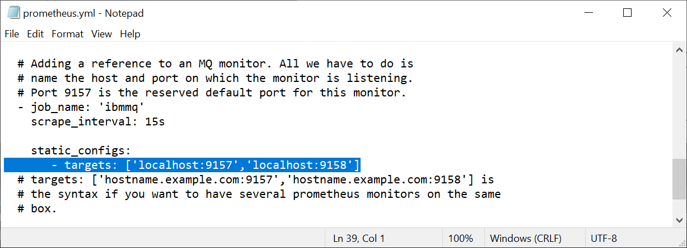

6. We'll also need to edit `prometheus.yml` on line 44 soon, but we'll need to get these configurations from New Relic.  For now, let's test to make sure this works by running the prometheus server
    ```
    prometheus.exe --config.file prometheus.yml --web.listen-address ":9090" --storage.tsdb.path "data"
    ```

7. Go to http://localhost:9090 and click on Status > Targets.  Make sure IBM MQ state is up
   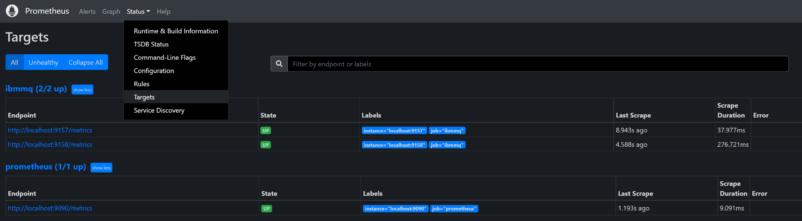


### Get Data into New Relic
1. Log into New Relic and click on Add Data, then search for Prometheus Remote Write Integration
   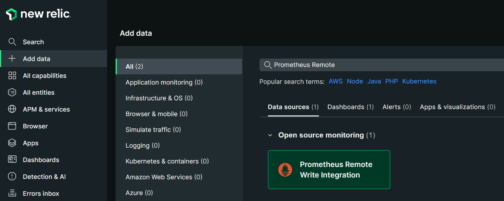


2. Give your data source a name and click on Generate url
   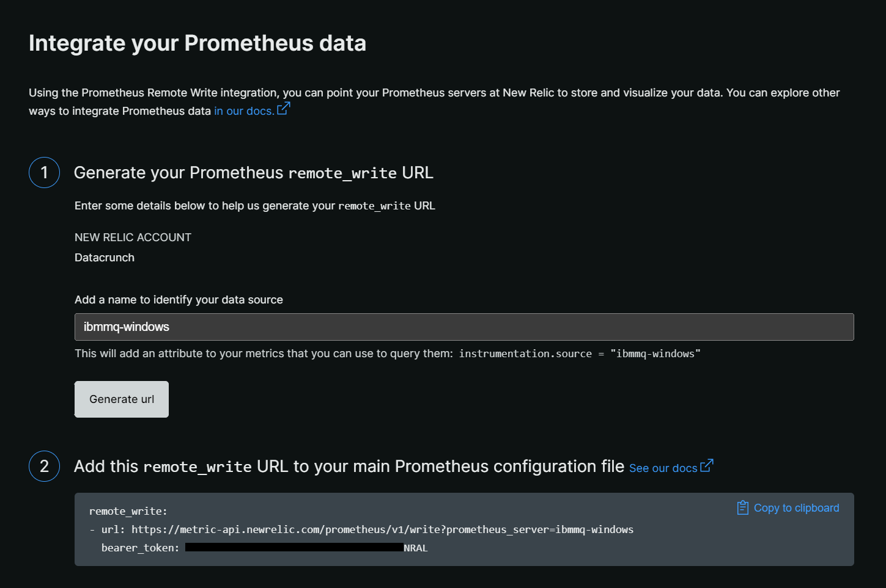


3. Copy the remote_write url and bearer_token to your prometheus.yml file on line 44 (basically the end of the file)
   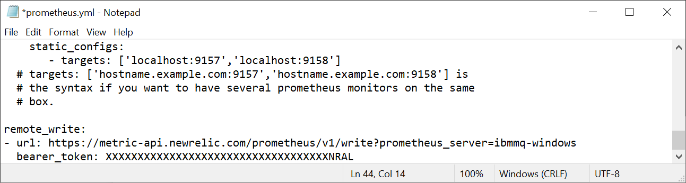


4. Restart Prometheus with the updated prometheus.yml file and check http://localhost:9090/ for IBM MQ metrics.  If it shows up in Prometheus, it should also show up in New Relic after a few minutes.


5. Download and install the IBM MQ New Relic I/O dashboard: https://newrelic.com/instant-observability/ibmmq/924fd4b3-a6d1-4a6e-9e2c-b598f197f713


6. View the dashboard, most data should show up without issue.
   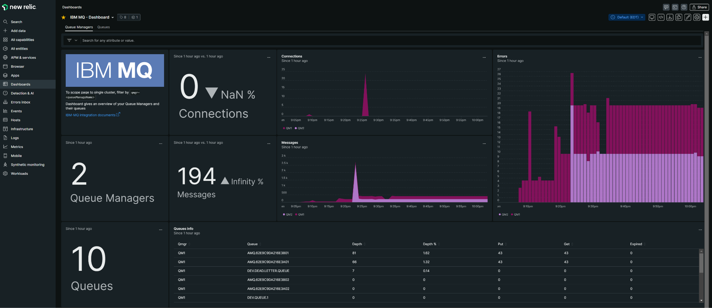
   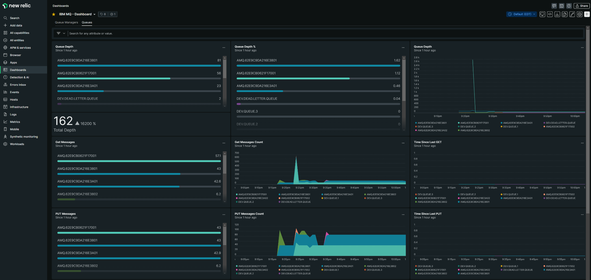


7. If you don't see the data you're looking for, check Data Explorer and enter "ibmmq" to see what you can chart out, for example, channel status.
   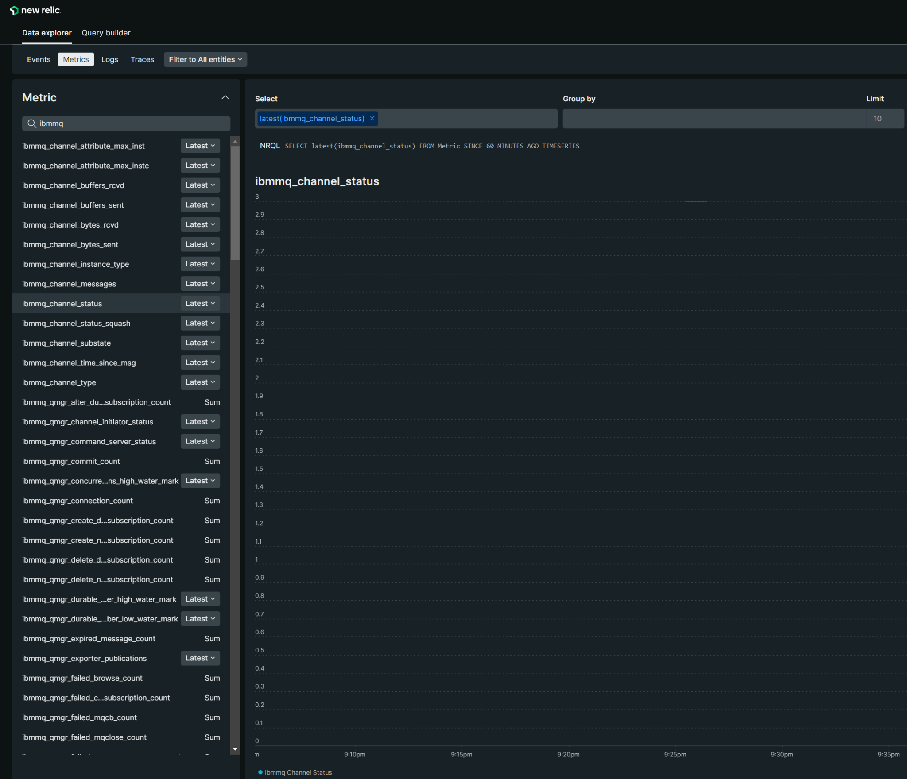


