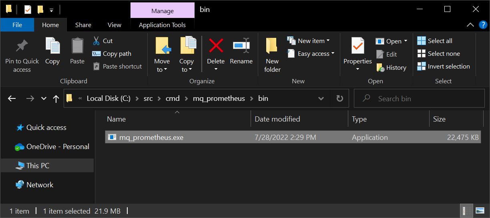

# IBM MQ Monitoring (Windows)

## Summary
At this time, New Relic IBM MQ monitoring solution is only supported in Linux.  This solution aims to be a temporary measure until Windows support is added.


## Instructions


### Prerequisites
1. You'll need your own instance of IBM MQ installed on Windows.  If you don't have one, follow the instructions here to get an IBM MQ instance for development on Windows: [IBM Developer](https://developer.ibm.com/tutorials/mq-connect-app-queue-manager-windows/#step-1-download-ibm-mq)

2. Set System Environment Variable: `MQ_ENABLE_METRICS=true`

3. Restart IBM MQ.  For example, `net stop MQ_Installation1 && net start MQ_Installation1`  
   


### Get the IBM MQ Prometheus Exporter
1. Download it from GitHub (unofficial binaries)  
   https://github.com/pnvnd/mq-metric-samples/releases


2. Otherwise, compile it yourself by installing `go`  
   https://golang.org/dl/


3. Install `tdm-gcc` (as per instructions on official IBM repository)
   https://jmeubank.github.io/tdm-gcc/download/


4. Clone the official repository from the IBM GitHub account somewhere on your computer  
    ```
    git clone https://github.com/ibm-messaging/mq-metric-samples.git c:\src
    ```
    

5. Change directory to the one containing the scripts for mq_prometheus
    ```
    cd c:/src/cmd/mq_prometheus
    ```
    

6. Run the following command to build the `mq_prometheus` exporter on your Windows machine.  This file can be copied to another location to be used later (`D:\mq-metric-samples` is used in this example later on).
    ```
    go build -o ./bin/mq_prometheus.exe
    ```
    


7. The `C:\src\cmd\mq_prometheus\bin\mq_prometheus.exe` is what we'll need to continue.  To test this, make sure your IBM MQ service has started.  In this case, I can either start the service from `services.msc` or use `net start MQ_Installation1`.
   


8. Next, make sure the queue manager is running.  In this case, I have two (2) queue managers named QM1 and QM2.  To start these two queue managers, I would need to use the following command
    ```
    strmqm QM1
    strmqm QM2
    ```
    

9. Get these two files and combine them into one: [config.common.yaml](https://github.com/ibm-messaging/mq-metric-samples/blob/master/config.common.yaml) and [config.collector.yaml](https://github.com/ibm-messaging/mq-metric-samples/blob/master/cmd/mq_prometheus/config.collector.yaml).  You'll require one of these files for each Queue Manager you need metrics for. Save these files where you have `mq_prometheus.exe` such as `D:\mq-metric-samples`.  After combining these two files into one (template) file, it should look like this:
   ```
   #
   # This is the section of the configuration file
   # that is common for all collectors. It gets combined
   # with the collector-specific portion to create the real
   # configuration file.

   global:
   useObjectStatus: true
   useResetQStats: false
   usePublications: true
   logLevel: INFO 
   metaprefix: ""
   pollInterval: 30s
   rediscoverInterval: 1h
   tzOffset: 0h

   connection:
      queueManager: QM1

   # You can point at a CCDT here. You probably will have to use this
   # for TLS client connections to a queue manager
      ccdtUrl:
   # For simple client configurations, set the connName and channel
      connName:
      channel:
   # If none of the channel-related attributes are set, then this can
   # be set to true to force client connectivity and the usual environment
   # variables such as MQSERVER are used.
      clientConnection: false

   # If a user is set, then a password must be passed somehow. It can
   # be done in this file, on a command line, or (better) passed via stdin
   #    user: mqadmin
   #    password: passw0rd                                             

   # Which queue should be used as the template for replies from the qmgr. This will 
   # usually be a QMODEL
      replyQueue: SYSTEM.DEFAULT.MODEL.QUEUE
   # If 'replyQueue' is set to a QLOCAL, then you must also set
   #   replyQueue2: A.DIFFERENT.QLOCAL

   # Using durable subscriptions for queue metrics reduces the need for MAXHANDS to be increased.
   # Setting this to a non-empty value switches the collectors to use durable subs. And then the
   # replyQueue and replyQueue2 values MUST refer to distinct QLOCALs. The value of this attribute must be
   # unique for any collector program connecting to this queue manager
      durableSubName: 

   objects:
      queues:
      - APP.*
      - "!SYSTEM.*,*"
      - "!AMQ.*"
      - QM*
      channels:
      - SYSTEM.*
      - TO.*
      - "*"
      topics:
      - "*"
      subscriptions:
      - "*"

   # The "filters" section gives additional control over what is collected for various
   # object types. Some fields in here used to be in other sections, but those
   # attributes now give an error to force configurations to move to this model.
   filters:
      # Setting this to "true" reduces the unique sets of data in the database, at the cost of
      # hiding metrics from separate instances. 
      hideSvrConnJobname: false
      # Setting this to "true" shows all channels, not just those that have some kind of active status
      showInactiveChannels: true
      # The number of subscriptions can be reduced by selecting a subset of types. Set to "NONE" to 
      # ignore all published queue metrics (but still keeping all queue manager metrics). The set
      # shown here gives best balance for number of subscriptions and useful metrics. If this is an empty 
      # list, all queue metrics are collected.
      queueSubscriptionSelector:
   #    - PUT
   #    - GET
   #    - GENERAL

   # This is the collector-specific piece of the configuration
   prometheus:
   port: 9157
   # We can constrain the http listener to a single adapter via the 'host' config. Default is
   # to bind to all local addresses
   # host: 1.2.3.4
   metricsPath: "/metrics"
   namespace: ibmmq
   # We can also set keystore information if the Prometheus instance uses TLS to contact the collector
   # httpsKeyFile:  "server.key"
   # httpsCertFile: "server.crt"
   # Keep running even if the qmgr is not available - allows a "STOPPED" status to be
   # returned to the Prometheus server.
   keepRunning: true
   # How often to check the status and to attempt to reconnect if there's been a failure  
   reconnectInterval: 5s
   ```
   For multiple Queue Managers, copy this template file and replace the `queueManager` name and `port` number.  If needed, you may also update the `user` and `password`.  Assuming I have two queue managers where I want QM1 metrics sent to port 9157 `ibmmq_qm1.yaml` and QM2 metrics sent to port 9158 `ibmmq_qm2.yaml`, copy these commands into a `BAT` file, save it somewhere such as `D:\mq-metric-samples`.  You can run the file to see if it works.
   ```mq_exporter.bat
   @echo off
   START /D D:\mq-metric-samples /B mq_prometheus.exe -f ibmmq_qm1.yaml
   START /D D:\mq-metric-samples /B mq_prometheus.exe -f ibmmq_qm2.yaml
   ```

   This command is saying: `START` from working directory `/D` `D:\mq-metric-samples` and run `mq_prometheus.exe` with configuration `f`ile `ibmmq_qm1.yaml` in the `/B`ackground.

   ### Commnad Line Alternative (Not Recommended)
   If you are running a `bat` file with the commands that include the configuration file, you can skip this step.  As an alternative, the command line can be used if you want the `mq_prometheus.exe` exporter to run. If you have multiple queue managers, you'll need to run this again for another queue manager on a different port.  Assuming I have two queue managers where I want QM1 metrics sent to port 9157 and QM2 metrics sent to port 9158, run these commands on separate terminals as an Administrator:
    ```
    mq_prometheus.exe 
    --ibmmq.queueManager "QM1" 
    --ibmmq.httpListenPort 9157 
    --ibmmq.monitoredQueues "!SYSTEM.*,*" 
    --ibmmq.monitoredChannels "*" 
    --ibmmq.monitoredTopics "*" 
    --ibmmq.monitoredSubscriptions "*" 
    --ibmmq.httpMetricPath "/metrics" 
    --ibmmq.useStatus

    mq_prometheus.exe 
    --ibmmq.queueManager "QM2" 
    --ibmmq.httpListenPort 9158 
    --ibmmq.monitoredQueues "!SYSTEM.*,*" 
    --ibmmq.monitoredChannels "*" 
    --ibmmq.monitoredTopics "*" 
    --ibmmq.monitoredSubscriptions "*" 
    --ibmmq.httpMetricPath "/metrics" 
    --ibmmq.useStatus
    ```
    


10. In some cases, depending on how your instance of IBM MQ permissions, or how  groups/roles is setup in Windows, you may also need the following flags in the command:
    ```
    --ibmmq.connName "localhost(1414)" 
    --ibmmq.channel "DEV.APP.SVRCONN" 
    --ibmmq.userid "app" 
    --ibmmq.password "passw0rd"
    ```

### Troubleshooting
To check the metrics being exported, you can do the following with the Command Prompt
```
curl localhost:9157/metrics
curl localhost:9158/metrics
```

Or with PowerShell
```
Invoke-WebRequest -Uri http://localhost:9157/metrics | Select-Object -Expand Content
Invoke-WebRequest -Uri http://localhost:9158/metrics | Select-Object -Expand Content
```


If you don't get a response, there may be an issue with your configuration file.

### Configure Prometheus using nri-prometheus (Recommended)
This is the preferred method to get IBM MQ metrics for a few reasons
- The New Relic Infrastructure agent has `nri-flex` built-in to run batch files in the background.  This makes running prometheus exporters seamless, where starting and stopping the `newrelic-infra` service runs and closes batch files.
- The New Relic Infrastructure agent has `nri-prometheus` built-in to scrape metrics from your desired endpoint, without needing to run a standalone prometheus server.

```mermaid
flowchart TB

    subgraph mq_prometheus[Prometheus Exporter]
    mq_prometheus.bat
    end

    subgraph nri-prometheus[New Relic Infrastructure Agent]
    newrelic-infra.yml
    nri-prometheus-config.yml
    end

    subgraph newrelic[New Relic]
    end

    mq_prometheus-->nri-prometheus-->newrelic
 ```

The setup is relatively simple.
1. Install the [New Relic Infrastructure Agent](https://download.newrelic.com/infrastructure_agent/windows/newrelic-infra.msi)
2. Add this config file `nri-prometheus-config.yml` to `C:\Program Files\New Relic\newrelic-infra\integrations.d`:
   ```nri-prometheus-config.yml
   integrations:
   - name: nri-flex
      interval: 1m
      timeout: 45s
      config:
         name: mq_prometheus
         apis:
         - ignore_output: true
         - event_type: mq_prometheus # Name of the event in New Relic
            commands:
               - run: "C:\\mq-metric-samples\\mq_exporter.bat"
               shell: cmd
               timeout: 30000

   - name: nri-prometheus
      config:
         # When standalone is set to false nri-prometheus requires an infrastructure agent to work and send data. Defaults to true
         standalone: false

         # When running with infrastructure agent emitters will have to include infra-sdk
         emitters: infra-sdk

         # The name of your cluster. It's important to match other New Relic products to relate the data.
         cluster_name: "ibmmq_exporter"

         targets:
         - description: IBM MQ Metric Samples
            urls: ["http://localhost:9157", "http://localhost:9158"]
         #    tls_config:
         #      ca_file_path: "/etc/etcd/etcd-client-ca.crt"
         #      cert_file_path: "/etc/etcd/etcd-client.crt"
         #      key_file_path: "/etc/etcd/etcd-client.key"

         # Whether the integration should run in verbose mode or not. Defaults to false.
         verbose: false

         # Whether the integration should run in audit mode or not. Defaults to false.
         # Audit mode logs the uncompressed data sent to New Relic. Use this to log all data sent.
         # It does not include verbose mode. This can lead to a high log volume, use with care.
         audit: false

         # The HTTP client timeout when fetching data from endpoints. Defaults to 30s.
         # scrape_timeout: "30s"

         # Length in time to distribute the scraping from the endpoints.
         scrape_duration: "5s"

         # Number of worker threads used for scraping targets.
         # For large clusters with many (>400) endpoints, slowly increase until scrape
         # time falls between the desired `scrape_duration`.
         # Increasing this value too much will result in huge memory consumption if too
         # many metrics are being scraped.
         # Default: 4
         # worker_threads: 4

         # Whether the integration should skip TLS verification or not. Defaults to false.
         insecure_skip_verify: false

      timeout: 10s
   ```
3. Restart `newrelic-infra` and check New Relic for the metrics.

### Configure Prometheus - Remote-Write Method (Outdated)
This method is out-dated and should only be used for troubleshooting.  If you've already set up prometheus using `nri-prometheus` then skip this section.

```mermaid
flowchart TB

    subgraph mq_prometheus[Prometheus Exporter]
    http://localhost:9157/metrics
    http://localhost:9158/metrics
    end

    subgraph prometheus[Prometheus Server]
    http://localhost:9090
    end

    subgraph newrelic[New Relic Remote Write]
    https://metric-api.newrelic.com/prometheus/v1/write?prometheus_server=ibmmq-windows
    bearer_token=XXXXXXXXXXXXXXXXXXXXXXXXXXXXXXXXNRAL
    end

    mq_prometheus-->prometheus-->newrelic
 ```

1. Download Prometheus for Windows and get the .zip version  
   https://prometheus.io/download/


2. Extract the contents somewhere sensible, such as `C:\prometheus-2.37.0.windows-amd64` for this example


3. Copy `C:\src\cmd\mq_prometheus\bin\mq_prometheus.exe` to `C:\prometheus-2.37.0.windows-amd64` for this example.
   

4. Copy `C:\src\cmd\mq_prometheus\prometheus.yml` to `C:\prometheus-2.37.0.windows-amd64` (you'll need to overwrite this file, since the yml file from the the official IBM repository does what we want)


5. Edit `prometheus.yml` line 39, assuming only one (1) Queue Manager
    ```
    - targets: ['localhost:9157']
    ```
    or for two Queue Managers
    ```
    - targets: ['localhost:9157','localhost:9158']
    ```
    

6. We'll also need to edit `prometheus.yml` on line 44 soon, but we'll need to get these configurations from New Relic.  For now, let's test to make sure this works by running the prometheus server
    ```
    prometheus.exe --config.file prometheus.yml --web.listen-address ":9090" --storage.tsdb.path "data"
    ```

7. Go to http://localhost:9090 and click on Status > Targets.  Make sure IBM MQ state is up
   


### Get Data into New Relic
1. Log into New Relic and click on Add Data, then search for Prometheus Remote Write Integration
   


2. Give your data source a name and click on Generate url
   


3. Copy the remote_write url and bearer_token to your prometheus.yml file on line 44 (basically the end of the file)
   


4. Restart Prometheus with the updated prometheus.yml file and check http://localhost:9090/ for IBM MQ metrics.  If it shows up in Prometheus, it should also show up in New Relic after a few minutes.


5. Download and install the IBM MQ New Relic I/O dashboard: https://newrelic.com/instant-observability/ibmmq/924fd4b3-a6d1-4a6e-9e2c-b598f197f713


6. View the dashboard, most data should show up without issue.
   
   


7. If you don't see the data you're looking for, check Data Explorer and enter "ibmmq" to see what you can chart out, for example, channel status.
   


