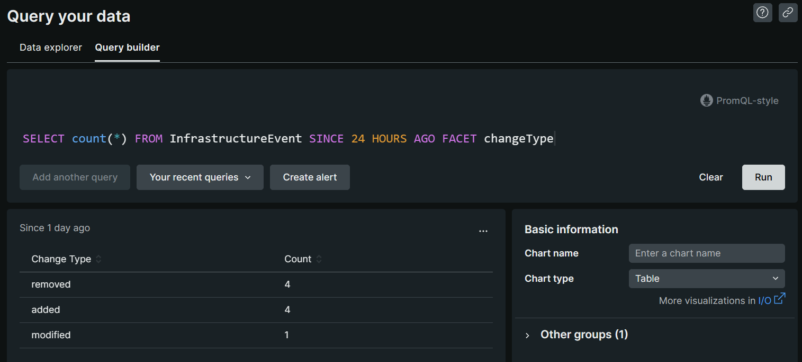
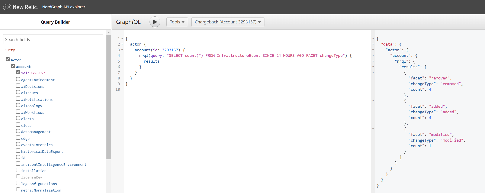
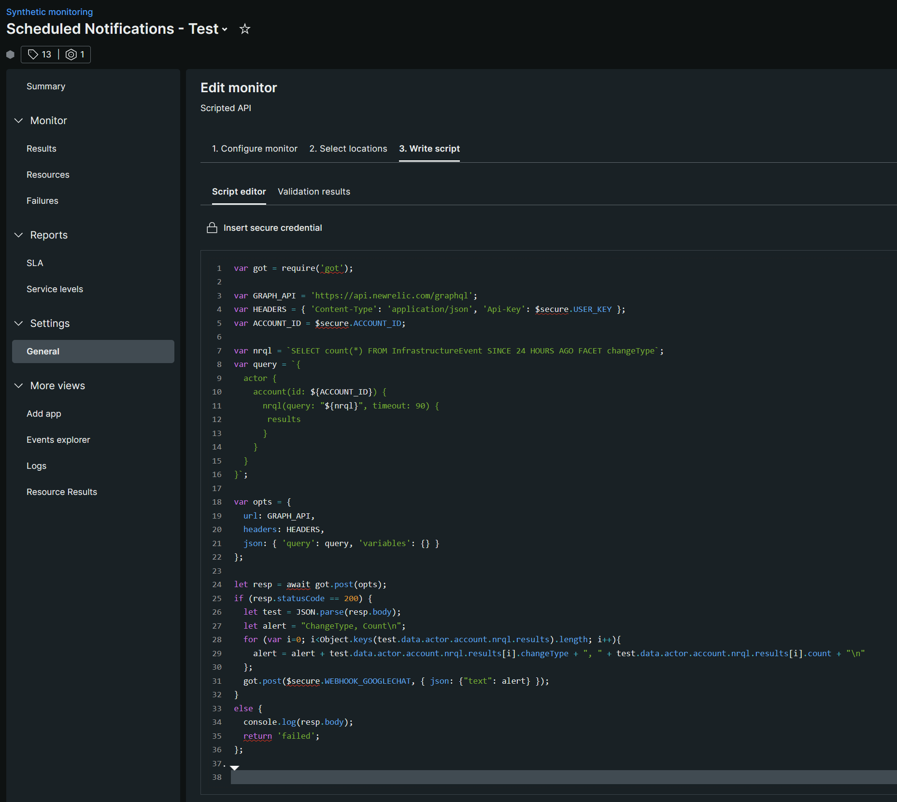
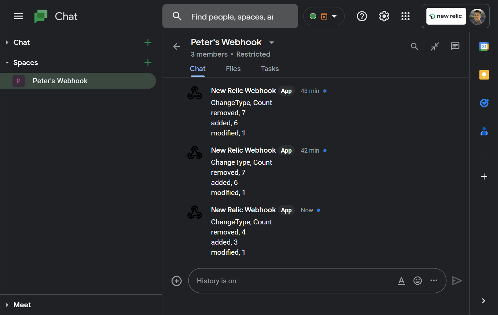
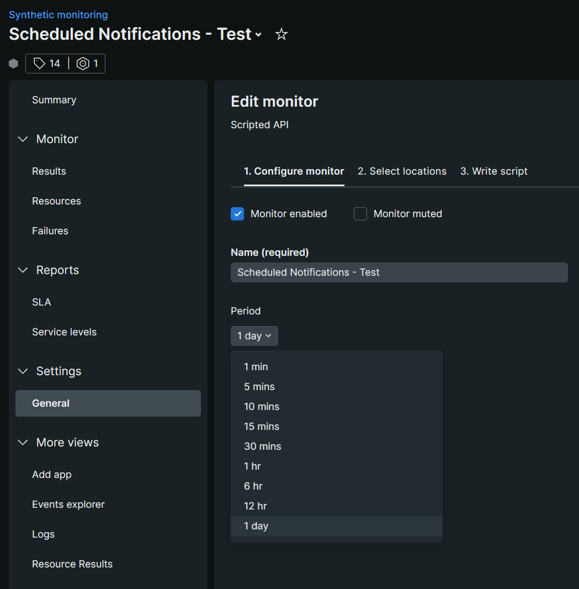
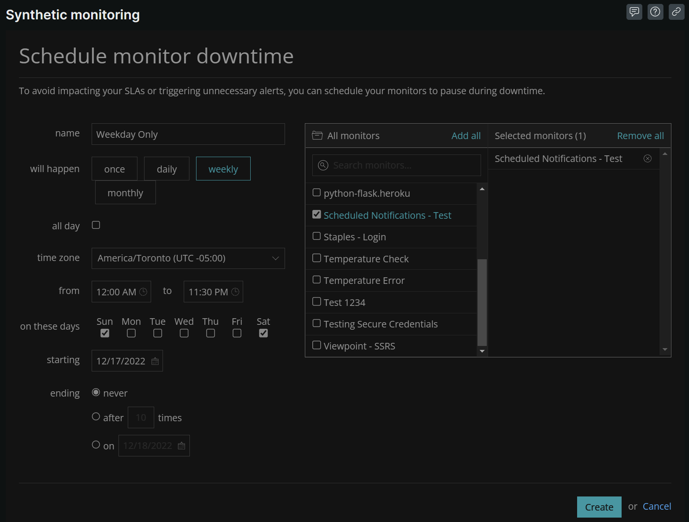

# Scheduled Notifications
We can schedule notifications using Synthetic monitors.  Although one caveat is, that you'd need to enable the synthetic monitor when you want start the scheduled notification.  For example, if you want a scheduled notification every day (24 hours)  at 9AM, enable the synthetic monitor at 9AM so that the notification can be sent again in 24 hours.

## Example
For this example, we'll use some `InfrastructureEvent` to simplify the data to be sent.  However, you can use whatever `NRQL` query you want.  Maybe `LIMIT 10` in case your webhook endpoint has a character limit.

### NRQL
We'll use the NRQL query `SELECT count(*) FROM InfrastructureEvent SINCE 24 HOURS AGO FACET changeType` for sample data.  The results looks something like this:  



| Change Type | Count |
| :---------- | :---- |
| removed     | 4     |
| added       | 4     |
| modified    | 1     |

### NerdGraph
To get the same data from NRQL where we can parse and send to a webhook, we'll use Graph*i*QL to demonstrate.  


```
{
  actor {
    account(id: 3293157) {
      nrql(query: "SELECT count(*) FROM InfrastructureEvent SINCE 24 HOURS AGO FACET changeType") {
        results
      }
    }
  }
}
```

The result is the following
```
{
  "data": {
    "actor": {
      "account": {
        "nrql": {
          "results": [
            {
              "facet": "removed",
              "changeType": "removed",
              "count": 4
            },
            {
              "facet": "added",
              "changeType": "added",
              "count": 4
            },
            {
              "facet": "modified",
              "changeType": "modified",
              "count": 1
            }
          ]
        }
      }
    }
  }
}
```

### Synthetics API Script
For our Synthetic monitor, we'll need to create an API Script test.  If you haven't already done so, create `Secure Credentials` for your `ACCOUNT_ID` and user `API_KEY`, and optionally, your `WEBHOOK_ENDPOINT`.  This script does three things:
1. Send a request to NerdGraph with our NRQL query
2. Parse the JSON result so we don;t see the other fields such as `data`, `actor`, etc.
3. Send the parsed result to some endpoint



```
var got = require('got');

var GRAPH_API = 'https://api.newrelic.com/graphql';
var HEADERS = { 'Content-Type': 'application/json', 'Api-Key': $secure.USER_KEY };
var ACCOUNT_ID = $secure.ACCOUNT_ID;

var nrql = `SELECT count(*) FROM InfrastructureEvent SINCE 24 HOURS AGO FACET changeType`;
var query = `{
  actor {
    account(id: ${ACCOUNT_ID}) {
      nrql(query: "${nrql}", timeout: 90) {
       results
      }
    }
  }
}`;

var opts = {
  url: GRAPH_API,
  headers: HEADERS,
  json: { 'query': query, 'variables': {} }
};

let resp = await got.post(opts);
if (resp.statusCode == 200) {
  let test = JSON.parse(resp.body);
  let alert = "ChangeType, Count\n";
  for (var i=0; i<Object.keys(test.data.actor.account.nrql.results).length; i++){
    alert = alert + test.data.actor.account.nrql.results[i].changeType + ", " + test.data.actor.account.nrql.results[i].count + "\n"
  };
  got.post($secure.WEBHOOK_GOOGLECHAT, { json: {"text": alert} });
}
else {
  console.log(resp.body);
  return 'failed';
};
```

### Webhook Endpoint
Depending on your endpoint, you may have to format the `json` payload so appears correctly.  In this example, we use Google Chat as the endpoint to send these notifications.  Once your synthetic script is setup, click on `Validate` to make sure the script works and check your webhook endpoint.  



### Scheduling Notifications
To schedule this notification, edit your Synthetic monitor to set the frequency of the checks.  For example, you can set this to once a day.  



However, if you prefer not to get the notifications on the weekends, you can also schedule monitor downtime to avoid getting notifications on the weekend.  

