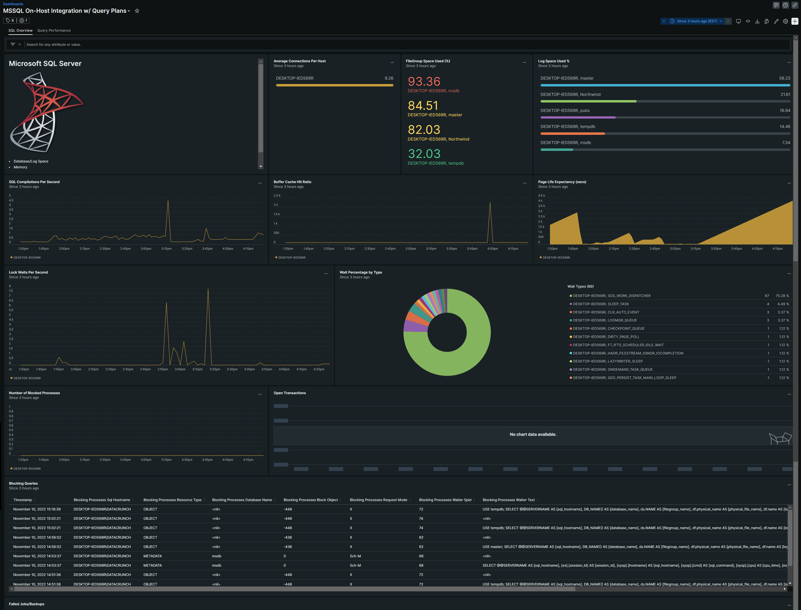
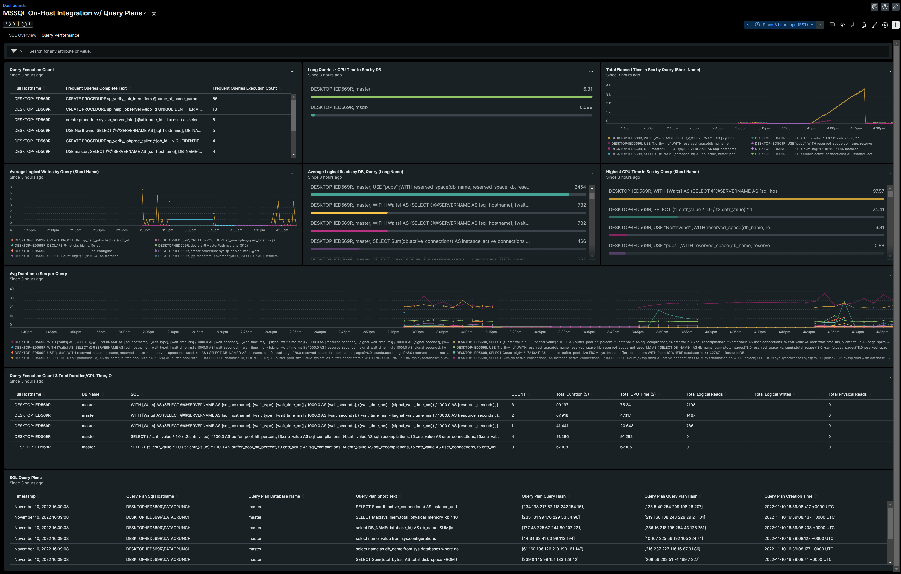
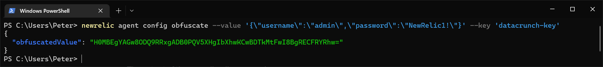

# Microsoft SQL Server
There are a few ways to monitor Microsoft SQL Server databases, and the process is mostly the same whether it is on-premise, on the cloud, or RDS instances. 
The following instructions assumes you are running a Windows Server (64-bit) operating system.

## Prerequisites
1. Download and install the [New Relic Infrastructure Agent](https://download.newrelic.com/infrastructure_agent/windows/newrelic-infra.msi).
2. Get a [New Relic Ingest - License Key](https://one.newrelic.com/api-keys) to complete the install
3. Add tags as needed

Here is a sample of what the `newrelic-infra.yml` file should look like:
```newrelic-infra.yml
license_key: XXXXXXXXXXXXXXXXXXXXXXXXXXXXXXXXXXXXNRAL
custom_attributes:
  team: dba-dev
```
## Installation
1. Download and install the [New Relic `nri-mssql` On-Host Integration](https://download.newrelic.com/infrastructure_agent/windows/integrations/nri-mssql/nri-mssql-amd64.msi).
2. Go to `C:\Program Files\New Relic\newrelic-infra\integrations.d` and rename `mssql-config.yml.sample` to `mssql-config.yml`

## Configuration
For this setup to work, you'll first need to create a monitoring user, or if you have one already, grant permissions to specific tables.

### Database Permissions

```sql
-- Create login and user "newrelic" for monitoring purposes on the "master" database, if it doesn't already exist
USE [master];
IF NOT EXISTS(SELECT principal_id FROM sys.server_principals WHERE name = 'newrelic') BEGIN
    CREATE LOGIN newrelic
    WITH PASSWORD = 'tmppassword'
END
IF NOT EXISTS(SELECT principal_id FROM sys.database_principals WHERE name = 'newrelic') BEGIN
    CREATE USER newrelic FOR LOGIN newrelic
END
GRANT CONNECT SQL TO newrelic;
GRANT VIEW SERVER STATE TO newrelic;
GRANT execute on sp_readErrorLog to newrelic; 

-- Goes through each user database and adds public permissions
DECLARE @name NVARCHAR(max)
DECLARE db_cursor CURSOR FOR
SELECT NAME
FROM master.dbo.sysdatabases
WHERE NAME NOT IN ('master','msdb','tempdb','model')
OPEN db_cursor
FETCH NEXT FROM db_cursor INTO @name WHILE @@FETCH_STATUS = 0
BEGIN
	EXECUTE('USE "' + @name + '"; CREATE USER newrelic FOR LOGIN newrelic;' );
	FETCH next FROM db_cursor INTO @name
END
CLOSE db_cursor
DEALLOCATE db_cursor

-- Create login and user "newrelic" for monitoring purposes on the "msdb" database, if it doesn't already exist
USE [msdb];
IF NOT EXISTS(SELECT principal_id FROM sys.server_principals WHERE name = 'newrelic') BEGIN
    CREATE LOGIN newrelic
    WITH PASSWORD = 'tmppassword'
END
IF NOT EXISTS(SELECT principal_id FROM sys.database_principals WHERE name = 'newrelic') BEGIN
    CREATE USER newrelic FOR LOGIN newrelic
END
GRANT SELECT on msdb.dbo.sysjobsteps TO newrelic;
GRANT SELECT on msdb.dbo.sysjobs TO newrelic;
GRANT SELECT on msdb.dbo.sysjobhistory TO newrelic;
```

### mssql-win-definition.yml
Upon installing `nri-mssql` you should get this file `mssql-win-definition.yml` found in `C:\Program Files\New Relic\newrelic-infra\newrelic-integrations`.  This file does not have to be modified, but if you don't have it, create it manually.  The contents look like this:
```yml
name: com.newrelic.mssql
description: Reports status and metrics for MSSQL service
protocol_version: 1
os: windows

commands:
  all_data:
    command:
      - .\bin\nri-mssql.exe
    prefix: config/mssql
    interval: 15

```

### mssql-config.yml
For this configuration, you'll need to provide your database connection details such as the `HOSTNAME`, `USERNAME`, `PASSWORD`, and `PORT`.

```yml
integrations:
- name: nri-mssql
  env:
    HOSTNAME: 192.168.0.123
    USERNAME: newrelic
    PASSWORD: tmppassword
    PORT: 1433
    ENABLE_BUFFER_METRICS: true
    ENABLE_DATABASE_RESERVE_METRICS: true 
    CUSTOM_METRICS_CONFIG: >-
      C:\Program Files\New Relic\newrelic-infra\integrations.d\mssql-custom-query.yml
  interval: 15s
  labels:
    env: production
    role: mssql
  inventory_source: config/mssql
```

### mssql-custom-query.yml
  To get data from the database, we need to run queries to get these metrics to send to New Relic.  This file is sensitive to `TAB` characters, so use spaces instead.

```yml
queries:
  - query: >-
      SELECT TOP 15
        @@SERVERNAME AS [sql_hostname],
        ISNULL(DB_NAME(t.dbid),'') AS [database_name],
        LEFT(t.[text], 50) AS [short_text], 
        qs.query_hash AS [query_hash],
        qs.query_plan_hash AS [query_plan_hash],
        CAST(qp.query_plan AS VARCHAR(MAX)) AS [query_plan],
        qs.execution_count AS [execution_count],
        qs.total_worker_time AS [cpu_time_total_ms],
        qs.total_worker_time/qs.execution_count AS [cpu_time_avg_ms],     
        qs.total_physical_reads AS [physical_reads_total],
        qs.total_physical_reads/qs.execution_count AS [physical_reads_avg],
        qs.total_logical_reads AS [logical_reads_total],
        qs.total_logical_reads/qs.execution_count AS [logical_reads_avg],
        qs.total_logical_writes AS [logical_writes_total],
        qs.total_logical_writes/qs.execution_count AS [logical_writes_avg],
        qs.total_elapsed_time AS [duration_total_ms],
        qs.total_elapsed_time/qs.execution_count AS [duration_avg_ms],
        qs.creation_time AS [creation_time],
        t.[text] AS [complete_text]
      FROM sys.dm_exec_query_stats AS qs WITH (NOLOCK)
      CROSS APPLY sys.dm_exec_sql_text(plan_handle) AS t
      CROSS APPLY sys.dm_exec_text_query_plan(plan_handle,0,-1) as qp
      ORDER BY qs.total_elapsed_time/qs.execution_count DESC;
    prefix: queryPlan_

    # Example for metric_name / metric_type specified in this config
  - query: SELECT count(*) AS 'metric_value' FROM sys.databases
    metric_name: dbCount
    metric_type: gauge
    # Example for metric_name from query, metric_type auto-detected, additional attribute 'category_type'
  - query: SELECT CONCAT('category_', category_id) AS metric_name, name AS metric_value, category_type FROM syscategories
    database: msdb
    # Example for stored procedure 'exec dbo.sp_server_info @attribute_id = 2'
  - query: dbo.sp_server_info @attribute_id = 2

# Example for showing active processes
# NRQL:
#  FROM MssqlCustomQuerySample 
#  SELECT activeProcesses_session_id, activeProcesses_sql_hostname, 
#  activeProcesses_sql_command, activeProcesses_cpu_time, 
#  activeProcesses_logical_read_count, activeProcesses_open_transaction_count, 
#  activeProcesses_blocking_session_id, activeProcesses_database_name, 
#  activeProcesses_login_name, activeProcesses_last_batch_time,
#  activeProcesses_spid_status, activeProcesses_wait_time, 
#  activeProcesses_last_wait_type, activeProcesses_query_text,
#  activeProcesses_program_name, activeProcesses_start_time 
#  WHERE activeProcesses_session_id IS NOT NULL
  - query: >-
      SELECT
        @@SERVERNAME AS [sql_hostname],
        [es].[session_Id] AS [session_id],
        [sysp].[hostname] AS [sql_hostname],
        [sysp].[cmd] AS [sql_command],
        [sysp].[cpu] AS [cpu_time],
        [es].[logical_reads] AS [logical_read_count],
        [sysp].[open_tran] AS [open_transaction_count],
        [sysp].[blocked] AS [blocking_session_id],
        DB_NAME([sysp].dbid) AS [database_name],
        [sysp].[loginame] AS [login_name],
        [sysp].[last_batch] AS [last_batch_time],
        [sysp].[status] AS [spid_status],
        [sysp].[waittime] AS [wait_time],
        [sysp].[lastwaittype] AS [last_wait_type],
        [qt].[text] AS [query_text],
        [sysp].[program_name] AS [program_name],
        [es].[last_request_start_time] AS [start_time]
      FROM master.sys.sysprocesses AS sysp
      INNER JOIN master.sys.dm_exec_sessions AS es ON [sysp].spid = [es].session_id
      CROSS APPLY master.sys.dm_exec_sql_text([sysp].sql_handle) AS qt
      WHERE session_Id > 50
      AND session_Id NOT IN (@@SPID)
      AND (
        [sysp].open_tran != 0
        OR
        [sysp].cmd != 'AWAITING COMMAND'
      );
    prefix: activeProcesses_

# Example for parsing Error Log
# NOTE: This requires elevated permissions as follows: 
# USE [master]
# GO
# CREATE USER [newrelic] FOR LOGIN [newrelic] WITH DEFAULT_SCHEMA=[dbo]
# GO
# GRANT execute on sp_readErrorLog to newrelic
# GO
# NRQL:
#  FROM MssqlCustomQuerySample 
#  SELECT errorLog_LogDate, errorLog_ProcessInfo, errorLog_Text
#  WHERE errorLog_LogDate IS NOT NULL
  - query: >-
      EXEC master.dbo.sp_readerrorlog 0, 1, NULL, NULL;
    prefix: errorLog_

# Example for querying busiest databases by logical R/W
# NRQL:
#  FROM MssqlCustomQuerySample
#  SELECT busiestDatabases_database_name, busiestDatabases_schema_name, busiestDatabases_total_page_reads, busiestDatabases_total_page_writes
#  WHERE busiestDatabases_database_name IS NOT NULL
  - query: >-
      SELECT
        @@SERVERNAME AS [sql_hostname],
        SUM(deqs.total_logical_reads) AS [total_page_reads],
        SUM(deqs.total_logical_writes) AS [total_page_writes],
        OBJECT_SCHEMA_NAME(dest.objectid, dest.dbid) AS [schema_name],
        CASE
          WHEN DB_NAME(dest.dbid) IS NULL THEN 'TechOps'
          ELSE DB_NAME(dest.dbid)
        END AS [database_name]
      FROM sys.dm_exec_query_stats deqs
      CROSS APPLY sys.dm_exec_sql_text(deqs.sql_handle) AS dest
      GROUP BY DB_NAME(dest.dbid),OBJECT_SCHEMA_NAME(dest.objectid, dest.dbid);
    database: master
    prefix: busiestDatabases_

# Example for checking database log space
# You would wand to repeat this query for every target. i.e.;  database: master 
# NRQL:
#  FROM MssqlCustomQuerySample
#  SELECT `logSpace_Database Name`, `logSpace_Log Size (MB)`,
#  `logSpace_Log Space Used (%)`, logSpace_Status
#  WHERE logSpace_database_name IS NOT NULL
  - query: DBCC SQLPERF(LOGSPACE);
    prefix: logSpace_

# Example for querying all wait types where count > 0
# NRQL:
#  FROM MssqlCustomQuerySample
#  SELECT waitTypes_sql_hostname, waitTypes_wait_type, waitTypes_wait_seconds, waitTypes_resource_seconds,
#  waitTypes_signal_seconds, waitTypes_wait_count, waitTypes_wait_percentage,
#  waitTypes_avg_wait_seconds, waitTypes_avg_resource_seconds, waitTypes_avg_signal_seconds
#  WHERE waitTypes_wait_type IS NOT NULL
  - query: >-
      WITH [Waits] AS
      (SELECT
        @@SERVERNAME AS [sql_hostname],
        [wait_type],
        [wait_time_ms] / 1000.0 AS [wait_seconds],
        ([wait_time_ms] - [signal_wait_time_ms]) / 1000.0 AS [resource_seconds],
        [signal_wait_time_ms] / 1000.0 AS [signal_seconds],
        [waiting_tasks_count] AS [wait_count],
        100.0 * [wait_time_ms] / SUM ([wait_time_ms]) OVER() AS [wait_percentage],
        ROW_NUMBER() OVER(ORDER BY [wait_time_ms] DESC) AS [row_number]
      FROM sys.dm_os_wait_stats
      WHERE [waiting_tasks_count] > 0
      )
      SELECT
        MAX([W1].[sql_hostname]) AS [sql_hostname],
        MAX([W1].[wait_type]) AS [wait_type],
        CAST(MAX([W1].[wait_seconds]) AS INT) AS [wait_seconds],
        CAST(MAX([W1].[resource_seconds]) AS INT) AS [resource_seconds],
        CAST(MAX([W1].[signal_seconds]) AS INT) AS [signal_seconds],
        MAX([W1].[wait_count]) AS [wait_count],
        CAST(MAX([W1].[wait_percentage]) AS INT) AS [wait_percentage],
        CAST((MAX([W1].[wait_seconds]) / MAX([W1].[wait_count])) AS INT) AS [avg_wait_seconds],
        CAST((MAX([W1].[resource_seconds]) / MAX([W1].[wait_count])) AS INT) AS [avg_resource_seconds],
        CAST((MAX([W1].[signal_seconds]) / MAX([W1].[wait_count])) AS INT) AS [avg_signal_seconds]
      FROM [Waits] AS [W1]
      INNER JOIN [Waits] AS [W2] ON [W2].[row_number] <= [W1].[row_number]
      GROUP BY [W1].[row_number];
    prefix: waitTypes_

# Example for top 15 longest running queries 
# NRQL:
#  FROM MssqlCustomQuerySample
#  SELECT longRunning_sql_hostname, longRunning_database_name, longRunning_schema_name, longRunning_short_text,
#  longRunning_execution_count, longRunning_cpu_time_total_ms, longRunning_cpu_time_avg_ms,
#  longRunning_physical_reads_total, longRunning_physical_reads_avg, longRunning_logical_reads_total,
#  longRunning_logical_reads_avg, longRunning_writes_total, longRunning_logical_writes_avg,
#  longRunning_duration_total_ms, longRunning_duration_avg_ms, longRunning_creation_time, longRunning_complete_text
#  WHERE longRunning_execution_count IS NOT NULL
  - query: >-
      SELECT TOP 15
        @@SERVERNAME AS [sql_hostname],
        ISNULL(DB_NAME(t.dbid),'') AS [database_name],
        LEFT(t.[text], 50) AS [short_text], 
        qs.execution_count AS [execution_count],
        qs.total_worker_time AS [cpu_time_total_ms],
        qs.total_worker_time/qs.execution_count AS [cpu_time_avg_ms],
        qs.total_physical_reads AS [physical_reads_total],
        qs.total_physical_reads/qs.execution_count AS [physical_reads_avg],
        qs.total_logical_reads AS [logical_reads_total],
        qs.total_logical_reads/qs.execution_count AS [logical_reads_avg],
        qs.total_logical_writes AS [logical_writes_total],
        qs.total_logical_writes/qs.execution_count AS [logical_writes_avg],
        qs.total_elapsed_time AS [duration_total_ms],
        qs.total_elapsed_time/qs.execution_count AS [duration_avg_ms],
        qs.creation_time AS [creation_time],
        OBJECT_SCHEMA_NAME(t.objectid, t.dbid) AS [schema_name],
        t.[text] AS [complete_text]
      FROM sys.dm_exec_query_stats AS qs WITH (NOLOCK)
      CROSS APPLY sys.dm_exec_sql_text(plan_handle) AS t
      WHERE t.[text] NOT LIKE '%SELECT TOP 15%qs.execution_count%'        --Ignore this query
      ORDER BY qs.total_elapsed_time/qs.execution_count DESC 
    prefix: longRunning_

# Example for top 15 most executed queries
# NRQL:
#  FROM MssqlCustomQuerySample
#  SELECT frequentQueries_sql_hostname, frequentQueries_database_name, frequentQueries_schema_name
#  frequentQueries_execution_count, frequentQueries_creation_time, frequentQueries_complete_text
#  WHERE frequentQueries_execution_count IS NOT NULL
  - query: >-
      SELECT TOP 15
        @@SERVERNAME AS [sql_hostname],
        ISNULL(DB_NAME(t.dbid),'') AS [database_name],
        qs.execution_count AS [execution_count],
        qs.creation_time AS [creation_time],
        OBJECT_SCHEMA_NAME(t.objectid, t.dbid) AS [schema_name],
        t.[text] AS [complete_text]
      FROM sys.dm_exec_query_stats AS qs WITH (NOLOCK)
      CROSS APPLY sys.dm_exec_sql_text(plan_handle) AS t
      WHERE t.[text] NOT LIKE '%SELECT TOP 15%qs.execution_count%'        --Ignore this query
      ORDER BY qs.execution_count DESC 
      OPTION (RECOMPILE);
    prefix: frequentQueries_

# Example for checking blocking processes in the SQL Instance
# NRQL:
#  FROM MssqlCustomQuerySample
#  SELECT blockingProcesses_sql_hostname, blockingProcesses_resource_type, blockingProcesses_database_name,
#  blockingProcesses_block_object, blockingProcesses_request_mode, blockingProcesses_waiter_spid,
#  blockingProcesses_waiter_text, blockingProcesses_blocking_spid, blockingProcesses_blocking_lock,
#  blockingProcesses_blocking_text
#  WHERE blockingProcesses_resource_type IS NOT NULL
  - query: >-
      SELECT 
        @@SERVERNAME AS [sql_hostname],
        t1.[resource_type],
        db_name(resource_database_id) AS [database_name],
        t1.resource_associated_entity_id AS [block_object],
        t1.[request_mode],
        t1.request_session_id AS [waiter_spid],
        (
          SELECT [text] FROM sys.dm_exec_requests AS r
          CROSS APPLY sys.dm_exec_sql_text(r.sql_handle)
          WHERE r.session_id = t1.request_session_id
        ) AS [waiter_text],
        t2.blocking_session_id AS [blocking_spid],
        (
          SELECT TOP 1 request_mode
          FROM sys.dm_tran_locks t1
          JOIN sys.dm_os_waiting_tasks t2 ON t1.request_session_id = t2.blocking_session_id
          WHERE request_mode NOT LIKE 'IX%'
          AND resource_type NOT LIKE 'DATABASE'
          AND resource_type NOT LIKE 'METADATA%'
          ORDER BY request_mode DESC
        ) AS [blocking_lock],
        (
          SELECT [text] FROM sys.sysprocesses AS p
          CROSS APPLY sys.dm_exec_sql_text(p.sql_handle)
          WHERE p.spid = t2.blocking_session_id
        ) AS [blocking_text]
      FROM sys.dm_tran_locks AS t1, sys.dm_os_waiting_tasks AS t2
      WHERE t1.lock_owner_address = t2.resource_address;
    prefix: blockingProcesses_

# Example for querying all failed jobs
# -- at the end of the query, minus 60 seconds for polling timeout
# NOTE: This requires the additional permissions below to gather failed job data
# USE [msdb]
# GO
# CREATE USER [newrelic] FOR LOGIN [newrelic] WITH DEFAULT_SCHEMA=[dbo]
# GO
# GRANT SELECT on msdb.dbo.sysjobsteps TO newrelic;
# GRANT SELECT on msdb.dbo.sysjobs TO newrelic;
# GRANT SELECT on msdb.dbo.sysjobhistory TO newrelic
# GO
# NRQL:
#  FROM MssqlCustomQuerySample
#  SELECT failedJobs_job_name, failedJobs_run_date,
#  failedJobs_run_time, failedJobs_run_status, failedJobs_sql_severity,
#  failedJobs_job_message, failedJobs_sql_hostname
#  WHERE failedJobs_job_name IS NOT NULL
  - query: >-
      SELECT j.[name] AS [job_name],h.[run_date],h.[run_time],h.[run_status],h.[sql_severity],h.[message] AS [job_message],h.[server] AS [sql_hostname]
      FROM msdb.dbo.sysjobhistory AS h
      JOIN msdb.dbo.sysjobs AS j ON h.job_id = j.job_id
      AND h.[run_date] >= CONVERT(VARCHAR, GETDATE(), 112)
      AND h.[run_time] >= REPLACE(CONVERT(VARCHAR, GETDATE(),108),':','')-60;
    database: msdb
    prefix: failedJobs_

# Example for checking database filegroup space
# You would need to repeat this query for every target database
# NRQL:
#  FROM MssqlCustomQuerySample
#  SELECT filegroupSpace_sql_hostname, filegroupSpace_database_name,
#  filegroupSpace_filegroup_name, filegroupSpace_physical_file_name,
#  filegroupSpace_logical_file_name, filegroupSpace_file_capacity_bytes,
#  filegroupSpace_file_used_bytes, filegroupSpace_file_used_percent
#  WHERE filegroupSpace_filegroup_name IS NOT NULL
  - query: >-
      SELECT
        @@SERVERNAME AS [sql_hostname],
        DB_NAME() AS [database_name],
        ds.NAME AS [filegroup_name],
        df.physical_name AS [physical_file_name],
        df.name AS [logical_file_name],
        CAST(df.size AS FLOAT) * 8 * 1024 AS [file_capacity_bytes],
        CAST(Fileproperty(df.name,'SpaceUsed')AS FLOAT) * 8 * 1024 AS [file_used_bytes],
        ROUND(CAST(Fileproperty(df.name,'SpaceUsed')AS FLOAT) /CAST(df.SIZE AS FLOAT) * 100, 2) AS [file_used_percent]
      FROM sys.database_files AS df
      JOIN sys.data_spaces AS ds ON df.data_space_id = ds.data_space_id;
    database: master
    prefix: filegroupSpace_

  - query: >-
      SELECT
        @@SERVERNAME AS [sql_hostname],
        DB_NAME() AS [database_name],
        ds.NAME AS [filegroup_name],
        df.physical_name AS [physical_file_name],
        df.name AS [logical_file_name],
        CAST(df.size AS FLOAT) * 8 * 1024 AS [file_capacity_bytes],
        CAST(Fileproperty(df.name,'SpaceUsed')AS FLOAT) * 8 * 1024 AS [file_used_bytes],
        ROUND(CAST(Fileproperty(df.name,'SpaceUsed')AS FLOAT) /CAST(df.SIZE AS FLOAT) * 100, 2) AS [file_used_percent]
      FROM sys.database_files AS df
      JOIN sys.data_spaces AS ds ON df.data_space_id = ds.data_space_id;
    database: msdb
    prefix: filegroupSpace_

  - query: >-
      SELECT
        @@SERVERNAME AS [sql_hostname],
        DB_NAME() AS [database_name],
        ds.NAME AS [filegroup_name],
        df.physical_name AS [physical_file_name],
        df.name AS [logical_file_name],
        CAST(df.size AS FLOAT) * 8 * 1024 AS [file_capacity_bytes],
        CAST(Fileproperty(df.name,'SpaceUsed')AS FLOAT) * 8 * 1024 AS [file_used_bytes],
        ROUND(CAST(Fileproperty(df.name,'SpaceUsed')AS FLOAT) /CAST(df.SIZE AS FLOAT) * 100, 2) AS [file_used_percent]
      FROM sys.database_files AS df
      JOIN sys.data_spaces AS ds ON df.data_space_id = ds.data_space_id;
    database: tempdb
    prefix: filegroupSpace_

  - query: >-
      SELECT
        @@SERVERNAME AS [sql_hostname],
        DB_NAME() AS [database_name],
        ds.NAME AS [filegroup_name],
        df.physical_name AS [physical_file_name],
        df.name AS [logical_file_name],
        CAST(df.size AS FLOAT) * 8 * 1024 AS [file_capacity_bytes],
        CAST(Fileproperty(df.name,'SpaceUsed')AS FLOAT) * 8 * 1024 AS [file_used_bytes],
        ROUND(CAST(Fileproperty(df.name,'SpaceUsed')AS FLOAT) /CAST(df.SIZE AS FLOAT) * 100, 2) AS [file_used_percent]
      FROM sys.database_files AS df
      JOIN sys.data_spaces AS ds ON df.data_space_id = ds.data_space_id;
    database: TechOps
    prefix: filegroupSpace_
```

## Dashboard
To see this data, you'll want to import this dashboard.  Note, you'll need to replace the `"accountId": 0` with your own account number.  You can do this by doing a Find and Replace `CTRL` + `H` in Notepad.

```mssql-query_dashboard.json
{
  "name": "MSSQL On-Host Integration w/ Query Plans",
  "description": "Sample SQL Server dashboard with query plans included",
  "permissions": "PUBLIC_READ_WRITE",
  "pages": [
    {
      "name": "SQL Overview",
      "description": null,
      "widgets": [
        {
          "title": "",
          "layout": {
            "column": 1,
            "row": 1,
            "width": 4,
            "height": 4
          },
          "linkedEntityGuids": null,
          "visualization": {
            "id": "viz.markdown"
          },
          "rawConfiguration": {
            "text": "# Microsoft SQL Server\n\n\n\n* Database/Log Space\n* Memory\n* Waits/Blocking\n* Blocked Processes\n\n\n"
          }
        },
        {
          "title": "Average Connections Per Host",
          "layout": {
            "column": 5,
            "row": 1,
            "width": 2,
            "height": 4
          },
          "linkedEntityGuids": null,
          "visualization": {
            "id": "viz.bar"
          },
          "rawConfiguration": {
            "facet": {
              "showOtherSeries": false
            },
            "nrqlQueries": [
              {
                "accountId": 0,
                "query": "SELECT average(`stats.connections`) FROM MssqlInstanceSample SINCE 1 hour AGO FACET displayName"
              }
            ],
            "platformOptions": {
              "ignoreTimeRange": false
            }
          }
        },
        {
          "title": "FileGroup Space Used (%)",
          "layout": {
            "column": 7,
            "row": 1,
            "width": 2,
            "height": 4
          },
          "linkedEntityGuids": null,
          "visualization": {
            "id": "viz.billboard"
          },
          "rawConfiguration": {
            "dataFormatters": [],
            "facet": {
              "showOtherSeries": false
            },
            "nrqlQueries": [
              {
                "accountId": 0,
                "query": " FROM MssqlCustomQuerySample SELECT latest(filegroupSpace_file_used_percent) WHERE filegroupSpace_database_name IS NOT NULL FACET displayName, filegroupSpace_database_name SINCE 1 hour ago"
              }
            ],
            "platformOptions": {
              "ignoreTimeRange": false
            },
            "thresholds": [
              {
                "alertSeverity": "WARNING",
                "value": 80
              },
              {
                "alertSeverity": "CRITICAL",
                "value": 90
              }
            ]
          }
        },
        {
          "title": "Log Space Used %",
          "layout": {
            "column": 9,
            "row": 1,
            "width": 4,
            "height": 4
          },
          "linkedEntityGuids": null,
          "visualization": {
            "id": "viz.bar"
          },
          "rawConfiguration": {
            "facet": {
              "showOtherSeries": false
            },
            "nrqlQueries": [
              {
                "accountId": 0,
                "query": "FROM MssqlCustomQuerySample SELECT latest(`logSpace_Log Space Used (%)`) WHERE `logSpace_Database Name` IS NOT NULL FACET displayName, `logSpace_Database Name`"
              }
            ],
            "platformOptions": {
              "ignoreTimeRange": false
            }
          }
        },
        {
          "title": "SQL Compilations Per Second",
          "layout": {
            "column": 1,
            "row": 5,
            "width": 4,
            "height": 3
          },
          "linkedEntityGuids": null,
          "visualization": {
            "id": "viz.line"
          },
          "rawConfiguration": {
            "facet": {
              "showOtherSeries": false
            },
            "legend": {
              "enabled": true
            },
            "nrqlQueries": [
              {
                "accountId": 0,
                "query": "SELECT average(`stats.sqlCompilationsPerSecond`) FROM MssqlInstanceSample TIMESERIES FACET displayName SINCE 1 hour ago"
              }
            ],
            "platformOptions": {
              "ignoreTimeRange": false
            },
            "yAxisLeft": {
              "zero": true
            }
          }
        },
        {
          "title": "Buffer Cache Hit Ratio",
          "layout": {
            "column": 5,
            "row": 5,
            "width": 4,
            "height": 3
          },
          "linkedEntityGuids": null,
          "visualization": {
            "id": "viz.line"
          },
          "rawConfiguration": {
            "facet": {
              "showOtherSeries": false
            },
            "legend": {
              "enabled": true
            },
            "nrqlQueries": [
              {
                "accountId": 0,
                "query": "SELECT average(`system.bufferPoolHitPercent`) AS 'Buffer Cache Hit Ratio' FROM MssqlInstanceSample TIMESERIES FACET displayName SINCE 1 hour ago"
              }
            ],
            "platformOptions": {
              "ignoreTimeRange": false
            },
            "yAxisLeft": {
              "zero": true
            }
          }
        },
        {
          "title": "Page Life Expectancy (secs)",
          "layout": {
            "column": 9,
            "row": 5,
            "width": 4,
            "height": 3
          },
          "linkedEntityGuids": null,
          "visualization": {
            "id": "viz.area"
          },
          "rawConfiguration": {
            "facet": {
              "showOtherSeries": false
            },
            "legend": {
              "enabled": true
            },
            "nrqlQueries": [
              {
                "accountId": 0,
                "query": "SELECT average(`bufferpool.pageLifeExpectancyInMilliseconds`) / 1000 FROM MssqlInstanceSample SINCE 1 hour AGO TIMESERIES FACET displayName"
              }
            ],
            "platformOptions": {
              "ignoreTimeRange": false
            }
          }
        },
        {
          "title": "Lock Waits Per Second",
          "layout": {
            "column": 1,
            "row": 8,
            "width": 5,
            "height": 4
          },
          "linkedEntityGuids": null,
          "visualization": {
            "id": "viz.line"
          },
          "rawConfiguration": {
            "facet": {
              "showOtherSeries": false
            },
            "legend": {
              "enabled": true
            },
            "nrqlQueries": [
              {
                "accountId": 0,
                "query": "SELECT average(`stats.lockWaitsPerSecond`) FROM MssqlInstanceSample TIMESERIES FACET displayName"
              }
            ],
            "platformOptions": {
              "ignoreTimeRange": false
            },
            "yAxisLeft": {
              "zero": true
            }
          }
        },
        {
          "title": "Wait Percentage by Type",
          "layout": {
            "column": 6,
            "row": 8,
            "width": 7,
            "height": 4
          },
          "linkedEntityGuids": null,
          "visualization": {
            "id": "viz.pie"
          },
          "rawConfiguration": {
            "facet": {
              "showOtherSeries": true
            },
            "legend": {
              "enabled": true
            },
            "nrqlQueries": [
              {
                "accountId": 0,
                "query": "SELECT latest(waitTypes_wait_percentage) AS 'Wait Type' FROM MssqlCustomQuerySample WHERE waitTypes_wait_type IS NOT NULL FACET displayName, waitTypes_wait_type LIMIT MAX"
              }
            ],
            "platformOptions": {
              "ignoreTimeRange": false
            }
          }
        },
        {
          "title": "Number of Blocked Processes",
          "layout": {
            "column": 1,
            "row": 12,
            "width": 4,
            "height": 3
          },
          "linkedEntityGuids": null,
          "visualization": {
            "id": "viz.line"
          },
          "rawConfiguration": {
            "facet": {
              "showOtherSeries": false
            },
            "legend": {
              "enabled": true
            },
            "nrqlQueries": [
              {
                "accountId": 0,
                "query": "SELECT average(`instance.blockedProcessesCount`) from MssqlInstanceSample timeseries since 1 hour ago FACET displayName"
              }
            ],
            "platformOptions": {
              "ignoreTimeRange": false
            },
            "yAxisLeft": {
              "zero": true
            }
          }
        },
        {
          "title": "Open Transactions",
          "layout": {
            "column": 5,
            "row": 12,
            "width": 8,
            "height": 3
          },
          "linkedEntityGuids": null,
          "visualization": {
            "id": "viz.table"
          },
          "rawConfiguration": {
            "dataFormatters": [],
            "facet": {
              "showOtherSeries": false
            },
            "nrqlQueries": [
              {
                "accountId": 0,
                "query": "FROM MssqlCustomQuerySample SELECT displayName, activeProcesses_session_id, activeProcesses_sql_hostname, activeProcesses_last_batch_time, activeProcesses_open_transaction_count, activeProcesses_database_name, activeProcesses_sql_command, activeProcesses_query_text, activeProcesses_program_name, activeProcesses_spid_status, activeProcesses_start_time, activeProcesses_cpu_time, activeProcesses_logical_read_count  WHERE activeProcesses_open_transaction_count > 0 since 1 day ago"
              }
            ],
            "platformOptions": {
              "ignoreTimeRange": false
            }
          }
        },
        {
          "title": "Blocking Queries",
          "layout": {
            "column": 1,
            "row": 15,
            "width": 12,
            "height": 4
          },
          "linkedEntityGuids": null,
          "visualization": {
            "id": "viz.table"
          },
          "rawConfiguration": {
            "dataFormatters": [],
            "facet": {
              "showOtherSeries": false
            },
            "nrqlQueries": [
              {
                "accountId": 0,
                "query": "FROM MssqlCustomQuerySample\nSELECT blockingProcesses_sql_hostname, blockingProcesses_resource_type, blockingProcesses_database_name,\nblockingProcesses_block_object, blockingProcesses_request_mode, blockingProcesses_waiter_spid,\nblockingProcesses_waiter_text, blockingProcesses_blocking_spid, blockingProcesses_blocking_lock,\nblockingProcesses_blocking_text\nWHERE blockingProcesses_resource_type IS NOT NULL SINCE 1 WEEK AGO\nLIMIT MAX"
              }
            ],
            "platformOptions": {
              "ignoreTimeRange": false
            }
          }
        },
        {
          "title": "Failed Jobs/Backups",
          "layout": {
            "column": 1,
            "row": 19,
            "width": 12,
            "height": 3
          },
          "linkedEntityGuids": null,
          "visualization": {
            "id": "viz.table"
          },
          "rawConfiguration": {
            "dataFormatters": [],
            "facet": {
              "showOtherSeries": false
            },
            "nrqlQueries": [
              {
                "accountId": 0,
                "query": "SELECT latest(failedJobs_job_message) FROM MssqlCustomQuerySample WHERE failedJobs_run_status IN (0,4) FACET displayName, failedJobs_job_name, failedJobs_run_date, failedJobs_run_time SINCE 1 day ago"
              }
            ],
            "platformOptions": {
              "ignoreTimeRange": false
            }
          }
        }
      ]
    },
    {
      "name": "Query Performance",
      "description": null,
      "widgets": [
        {
          "title": "Query Execution Count",
          "layout": {
            "column": 1,
            "row": 1,
            "width": 4,
            "height": 3
          },
          "linkedEntityGuids": null,
          "visualization": {
            "id": "viz.table"
          },
          "rawConfiguration": {
            "dataFormatters": [],
            "facet": {
              "showOtherSeries": false
            },
            "nrqlQueries": [
              {
                "accountId": 0,
                "query": "FROM MssqlCustomQuerySample SELECT latest(frequentQueries_execution_count) FACET frequentQueries_sql_hostname, frequentQueries_complete_text"
              }
            ],
            "platformOptions": {
              "ignoreTimeRange": false
            }
          }
        },
        {
          "title": "Long Queries - CPU Time in Sec by DB",
          "layout": {
            "column": 5,
            "row": 1,
            "width": 4,
            "height": 3
          },
          "linkedEntityGuids": null,
          "visualization": {
            "id": "viz.bar"
          },
          "rawConfiguration": {
            "facet": {
              "showOtherSeries": false
            },
            "nrqlQueries": [
              {
                "accountId": 0,
                "query": "FROM MssqlCustomQuerySample SELECT latest(longRunning_cpu_time_total_ms)/1000 WHERE longRunning_database_name IS NOT NULL AND longRunning_database_name != '' FACET longRunning_sql_hostname, longRunning_database_name"
              }
            ],
            "platformOptions": {
              "ignoreTimeRange": false
            }
          }
        },
        {
          "title": "Total Elapsed Time in Sec by Query (Short Name)",
          "layout": {
            "column": 9,
            "row": 1,
            "width": 4,
            "height": 3
          },
          "linkedEntityGuids": null,
          "visualization": {
            "id": "viz.line"
          },
          "rawConfiguration": {
            "facet": {
              "showOtherSeries": false
            },
            "legend": {
              "enabled": true
            },
            "nrqlQueries": [
              {
                "accountId": 0,
                "query": "FROM MssqlCustomQuerySample SELECT latest(longRunning_duration_total_ms)/1000 WHERE longRunning_short_text IS NOT NULL FACET longRunning_sql_hostname, longRunning_short_text TIMESERIES 1 MINUTE"
              }
            ],
            "platformOptions": {
              "ignoreTimeRange": false
            },
            "yAxisLeft": {
              "zero": false
            }
          }
        },
        {
          "title": " Average Logical Writes by Query (Short Name)",
          "layout": {
            "column": 1,
            "row": 4,
            "width": 4,
            "height": 3
          },
          "linkedEntityGuids": null,
          "visualization": {
            "id": "viz.line"
          },
          "rawConfiguration": {
            "facet": {
              "showOtherSeries": false
            },
            "legend": {
              "enabled": true
            },
            "nrqlQueries": [
              {
                "accountId": 0,
                "query": "FROM MssqlCustomQuerySample SELECT latest(longRunning_logical_writes_avg) WHERE longRunning_short_text IS NOT NULL FACET longRunning_sql_hostname, longRunning_short_text TIMESERIES 1 MINUTE LIMIT MAX"
              }
            ],
            "platformOptions": {
              "ignoreTimeRange": false
            },
            "yAxisLeft": {
              "zero": true
            }
          }
        },
        {
          "title": "Average Logical Reads by DB, Query (Long Name)",
          "layout": {
            "column": 5,
            "row": 4,
            "width": 4,
            "height": 3
          },
          "linkedEntityGuids": null,
          "visualization": {
            "id": "viz.bar"
          },
          "rawConfiguration": {
            "facet": {
              "showOtherSeries": false
            },
            "nrqlQueries": [
              {
                "accountId": 0,
                "query": "FROM MssqlCustomQuerySample SELECT latest(longRunning_logical_reads_avg) WHERE longRunning_short_text IS NOT NULL FACET longRunning_sql_hostname, longRunning_database_name, longRunning_complete_text LIMIT MAX"
              }
            ],
            "platformOptions": {
              "ignoreTimeRange": false
            }
          }
        },
        {
          "title": "Highest CPU Time in Sec by Query (Short Name)",
          "layout": {
            "column": 9,
            "row": 4,
            "width": 4,
            "height": 3
          },
          "linkedEntityGuids": null,
          "visualization": {
            "id": "viz.bar"
          },
          "rawConfiguration": {
            "facet": {
              "showOtherSeries": false
            },
            "nrqlQueries": [
              {
                "accountId": 0,
                "query": "FROM MssqlCustomQuerySample SELECT latest(longRunning_cpu_time_total_ms)/1000 WHERE longRunning_short_text IS NOT NULL FACET longRunning_sql_hostname, longRunning_short_text LIMIT MAX"
              }
            ],
            "platformOptions": {
              "ignoreTimeRange": false
            }
          }
        },
        {
          "title": "Avg Duration in Sec per Query",
          "layout": {
            "column": 1,
            "row": 7,
            "width": 12,
            "height": 3
          },
          "linkedEntityGuids": null,
          "visualization": {
            "id": "viz.line"
          },
          "rawConfiguration": {
            "facet": {
              "showOtherSeries": false
            },
            "legend": {
              "enabled": true
            },
            "nrqlQueries": [
              {
                "accountId": 0,
                "query": "FROM MssqlCustomQuerySample SELECT latest(longRunning_duration_avg_ms)/1000 WHERE longRunning_complete_text IS NOT NULL FACET longRunning_sql_hostname, longRunning_complete_text TIMESERIES AUTO LIMIT MAX"
              }
            ],
            "platformOptions": {
              "ignoreTimeRange": false
            },
            "yAxisLeft": {
              "zero": true
            }
          }
        },
        {
          "title": "Query Execution Count & Total Duration/CPU Time/IO",
          "layout": {
            "column": 1,
            "row": 10,
            "width": 12,
            "height": 3
          },
          "linkedEntityGuids": null,
          "visualization": {
            "id": "viz.table"
          },
          "rawConfiguration": {
            "dataFormatters": [],
            "facet": {
              "showOtherSeries": false
            },
            "nrqlQueries": [
              {
                "accountId": 0,
                "query": "FROM MssqlCustomQuerySample SELECT latest(longRunning_duration_total_ms)/1000 AS 'Total Duration (s)', latest(longRunning_cpu_time_total_ms)/1000 AS 'Total CPU Time (s)', latest(longRunning_logical_reads_total) AS 'Total Logical Reads', latest(longRunning_writes_total) AS 'Total Logical Writes', latest(longRunning_physical_reads_total) AS 'Total Physical Reads' FACET longRunning_sql_hostname, longRunning_database_name AS 'DB Name', longRunning_complete_text AS 'SQL', longRunning_execution_count AS 'COUNT' WHERE longRunning_execution_count IS NOT NULL LIMIT 5"
              }
            ],
            "platformOptions": {
              "ignoreTimeRange": false
            }
          }
        },
        {
          "title": "SQL Query Plans",
          "layout": {
            "column": 1,
            "row": 13,
            "width": 12,
            "height": 3
          },
          "linkedEntityGuids": null,
          "visualization": {
            "id": "viz.table"
          },
          "rawConfiguration": {
            "facet": {
              "showOtherSeries": false
            },
            "nrqlQueries": [
              {
                "accountId": 0,
                "query": "SELECT queryPlan_sql_hostname, queryPlan_database_name, queryPlan_short_text, queryPlan_query_hash, queryPlan_query_plan_hash, queryPlan_creation_time FROM MssqlCustomQuerySample WHERE queryPlan_short_text IS NOT NULL LIMIT 10"
              }
            ],
            "platformOptions": {
              "ignoreTimeRange": false
            }
          }
        }
      ]
    }
  ]
}
```

Here's what the dashboards should look like:




## FAQs

### I can't expose my credentials in the `mssql-config.yml` file, how to deal with this?
Use the New Relic CLI tool to obfuscate usernames, passwords, etc.

```cmd
newrelic agent config obfuscate --value '{\"username\":\"sa\",\"password\":\"NewRelic1!\"}' --key 'datacrunch-key'
```


Note: Windows users MUST escape double-quote characters in both `cmd` and `powershell`.

After running the command above, you should get an obfuscatedValue (secret).  Update your `mssql-config.yml` so that it looks like this:

```mssql-config.yml
# newrelic agent config obfuscate --value '{\"username\":\"admin\",\"password\":\"NewRelic1!\"}' --key 'datacrunch-key'
variables:
   creds:
     obfuscated:
       key: "datacrunch-key"
       secret: "H0MBEgYAGw8ODQ9RRxgADB0PQV5XHgIbXhwKCwBDTkMtFwI8BgRECFRYRhw="

integrations:
- name: nri-mssql
  env:
    HOSTNAME: datacrunch-prod.host.ca-central-1.rds.amazonaws.com
    USERNAME: ${creds.username}
    PASSWORD: ${creds.password}
    PORT: 1433
    ENABLE_BUFFER_METRICS: true
    ENABLE_DATABASE_RESERVE_METRICS: true 
    CUSTOM_METRICS_CONFIG: >-
      C:\Program Files\New Relic\newrelic-infra\integrations.d\mssql-custom-query.yml
  interval: 15s
  labels:
    env: production
    role: mssql
  inventory_source: config/mssql
```

### Where do I get the New Relic CLI tool?
Download the New Relic CLI tool from https://github.com/newrelic/newrelic-cli/releases

1. Extract the files to a location such as `C:\Program Files\New Relic\New Relic CLI`
2. Add `C:\Program Files\New Relic\New Relic CLI` to your `PATH` environment variable
3. Open a terminal and try this command `newrelic -v` to see if it works

### How do I monitor multiple instances on the same machine?
Simply copy and paste the configuration under `integrations` with the credentials for the other instances.  For example, your `mssql-config.yml` should look this this for two instances:

```yml
# newrelic agent config obfuscate --value '{\"username\":\"admin\",\"password\":\"NewRelic1!\"}' --key 'datacrunch-key'
variables:
   creds:
     obfuscated:
       key: "datacrunch-key"
       secret: "H0MBEgYAGw8ODQ9RRxgADB0PQV5XHgIbXhwKCwBDTkMtFwI8BgRECFRYRhw="

integrations:
- name: nri-mssql
  env:
    HOSTNAME: datacrunch-prod.host.ca-central-1.rds.amazonaws.com
    USERNAME: ${creds.username}
    PASSWORD: ${creds.password}
    PORT: 1433
    ENABLE_BUFFER_METRICS: true
    ENABLE_DATABASE_RESERVE_METRICS: true 
    CUSTOM_METRICS_CONFIG: >-
      C:\Program Files\New Relic\newrelic-infra\integrations.d\mssql-custom-query.yml
  interval: 15s
  labels:
    env: production
    role: mssql
  inventory_source: config/mssql

- name: nri-mssql
  env:
    HOSTNAME: datacrunch-dev.host.ca-central-1.rds.amazonaws.com
    USERNAME: ${creds.username}
    PASSWORD: ${creds.password}
    PORT: 1433
    ENABLE_BUFFER_METRICS: true
    ENABLE_DATABASE_RESERVE_METRICS: true 
    CUSTOM_METRICS_CONFIG: >-
      C:\Program Files\New Relic\newrelic-infra\integrations.d\mssql-custom-query.yml
  interval: 30s
  labels:
    env: production
    role: mssql
  inventory_source: config/mssql
```


