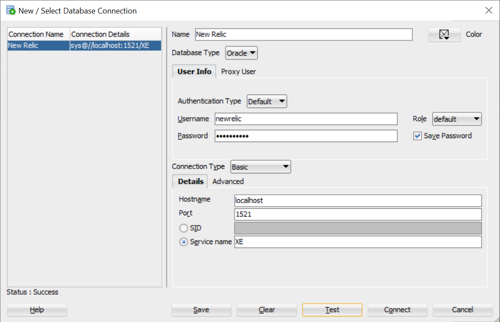
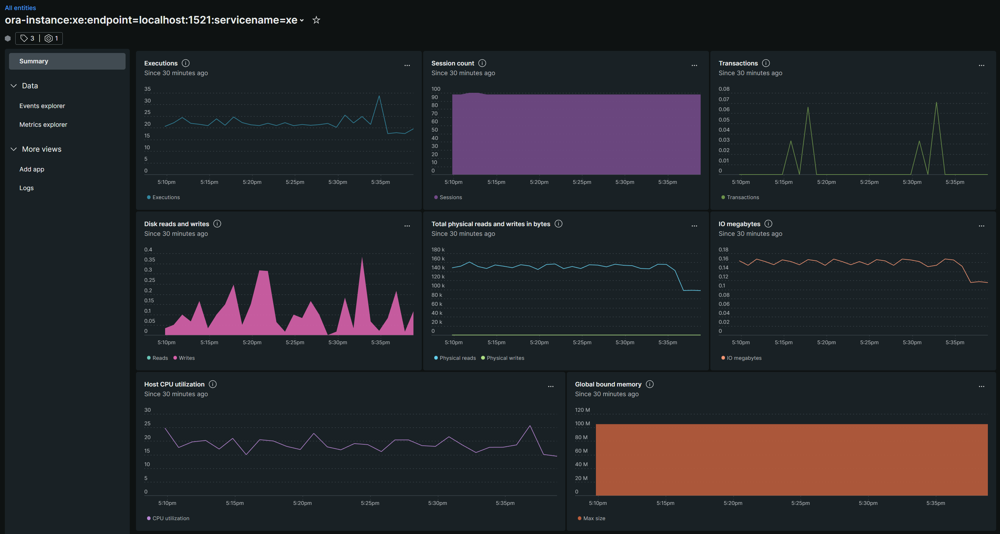

# Oracle Database Monitoring

The on-host integration `nri-oracle` is supported in Linux, but is not supported in Windows by New Relic.  As well, at the time of this writing, `nri-oracledb` cannot be compiled for `arm64` due to errors.  The following instructions assumes you are using Oracle 21c.

## Prerequisites
1. Download and install the [New Relic Infrastructure Agent](https://download.newrelic.com/infrastructure_agent/windows/newrelic-infra.msi).
2. Get a [New Relic Ingest - License Key](https://one.newrelic.com/api-keys) to complete the install
3. Add tags as needed

Here is a sample of what the `newrelic-infra.yml` file should look like:
```newrelic-infra.yml
license_key: XXXXXXXXXXXXXXXXXXXXXXXXXXXXXXXXXXXXNRAL
custom_attributes:
  team: dba-dev
```

## Permissions
Log in a `SYSDBA` role and run the following script to create a `newrelic` monitoring user with permissions to access some tables.

```oracledb-permissions.sql
ALTER SESSION set "_Oracle_SCRIPT"=true;
CREATE USER newrelic IDENTIFIED BY "NewRelic1!";
GRANT CONNECT TO newrelic;
GRANT SELECT ON cdb_data_files TO newrelic;
GRANT SELECT ON cdb_pdbs TO newrelic;
GRANT SELECT ON cdb_users TO newrelic;
GRANT SELECT ON gv_$sysmetric TO newrelic;
GRANT SELECT ON gv_$pgastat TO newrelic;
GRANT SELECT ON gv_$instance TO newrelic;
GRANT SELECT ON gv_$filestat TO newrelic;
GRANT SELECT ON gv_$parameter TO newrelic;
GRANT SELECT ON sys.dba_data_files TO newrelic;
GRANT SELECT ON DBA_TABLESPACES TO newrelic;
GRANT SELECT ON DBA_TABLESPACE_USAGE_METRICS TO newrelic;
GRANT SELECT ON gv_$session TO newrelic;
GRANT SELECT ON gv_$sesstat TO newrelic;
GRANT SELECT ON gv_$statname TO newrelic;
GRANT SELECT ON gv_$rowcache TO newrelic;
GRANT SELECT ON gv_$sga TO newrelic;
GRANT SELECT ON gv_$sysstat TO newrelic;
GRANT SELECT ON v_$database TO newrelic;
GRANT SELECT ON gv_$librarycache TO newrelic;
GRANT SELECT ON gv_$sqlarea TO newrelic;
GRANT SELECT ON gv_$system_event TO newrelic;
GRANT SELECT ON dba_tablespaces TO newrelic;
GRANT SELECT ON gv_$session_wait TO newrelic;
GRANT SELECT ON gv_$rollstat TO newrelic;
GRANT SELECT ON v_$instance TO newrelic;
```

Log in with the following credentials to test if everything works.  


| Field | Setting |
| :-------- | -------- |
| Username | `newrelic` |
| password | `NewRelic1!` |
| role | default |
| hostname | localhost |
| port | 1521 |
| SID | XE |
| Service Name |  XE |

## Installation

### Linux

For Ubuntu/Debian, run this command:  
```bash
sudo apt-get update && apt-get install nri-oracledb
```

For CentOS/RHEL, the these:  
```bash
sudo yum -q makecache -y --disablerepo='*' --enablerepo='newrelic-infra' && yum install nri-oracledb
```

Otherwise, to install manually, download and install the [New Relic `nri-oracledb` On-Host Integration](https://github.com/newrelic/nri-oracledb/releases).

The following command should download and extract the files to the correct locations in Linux:
```
curl -OL https://github.com/newrelic/nri-oracledb/releases/download/vx.x.x/nri-oracledb_linux_x.x.x_amd64.tar.gz
sudo tar -C / -xvf nri-oracledb_linux_x.x.x_amd64.tar.gz
```


The Linux file structure should look something like this.  You should also manually create [oracledb-custom-query.yml](tutorials/db/oracledb.md?id=oracledb-custom-queryyml).

```
+---etc
|   \---newrelic-infra
|       \---integrations.d
|               oracledb-config.yml
|               oracledb-custom-query.yml
|
\---var
    \---db
        \---newrelic-infra
            \---newrelic-integrations
                |   oracledb-definition.yml
                |
                \---bin
                        nri-oracledb
```

### Windows
Windows is not supported, so you'll need to clone the [nri-oracledb repository](https://github.com/newrelic/nri-oracledb) and compile it yourself with [golang](https://go.dev/doc/install).

```powershell
git clone https://github.com/newrelic/nri-oracledb
cd .\nri-oracledb
go build -o .\bin\nri-oracledb.exe .\src
cp .\bin\nri-oracledb.exe C:\Program Files\New Relic\newrelic-infra\newrelic-integrations\bin\
cp .\legacy\oracledb-definition.yml C:\Program Files\New Relic\newrelic-infra\newrelic-integrations\oracledb-win-definition.yml
cp .\oracledb-config.yml.sample C:\Program Files\New Relic\newrelic-infra\integrations.d\oracledb-config.yml
cp .\oracledb-custom-query.yml.sample C:\Program Files\New Relic\newrelic-infra\integrations.d\oracledb-custom-query.yml
```

The file structure for Windows should look like this after running the commands above.

```
C:\Program Files\New Relic\newrelic-infra
+---integrations.d
|       oracledb-config.yml
|       oracledb-custom-query.yml
|
\---newrelic-integrations
    |   oracledb-win-definition.yml
    |
    \---bin
            nri-oracledb.exe
```

## oracledb-win-definition.yml
The Linux `oracledb-definition.yml` does not need further modification.  This file has been renamed for Windows only.  Edit this file so it looks like this

```
name: com.newrelic.oracledb
description: Reports status and metrics for oracledb service
protocol_version: 2
os: windows

commands:
  all_data:
    command:
      - .\bin\nri-oracledb.exe
    interval: 15
    prefix: config/oracledb
```

## oracledb-custom-query.yml

The `oracledb-custom-query.yml` does not need any modifications, unless you want to include your own queries.

```
queries:
  - query: >-
      SELECT
        SUM(stat.gets) AS "gets",
        SUM(stat.waits) AS "waits",
        SUM(stat.waits)/SUM(stat.gets) AS "ratio",
        inst.inst_id
      FROM GV$ROLLSTAT stat, GV$INSTANCE inst
      WHERE stat.inst_id=inst.inst_id
      GROUP BY inst.inst_id
```

## oracledb-config.yml
This config file should look like this in general.  Comment out paths for `ORACLE_HOME` and `CUSTOM_METRICS_CONFIG` as needed by your operating system.

For Linux users, rename `oracledb-config.yml.sample` to `oracledb-config.yml`.
```
sudo cp /etc/newrelic-infra/integrations.d/oracledb-config.yml.sample /etc/newrelic-infra/integrations.d/oracledb-config.yml
```

```
integrations:
- name: nri-oracledb
  env:
    SERVICE_NAME: XE
    HOSTNAME: localhost
    PORT: 1521
    USERNAME: newrelic
    PASSWORD: NewRelic1!
    # ORACLE_HOME: D:\app\Peter\product\21c\dbhomeXE
    ORACLE_HOME: /opt/oracle/product/21c/dbhomeXE
    EXTENDED_METRICS: true

    # Disable connection pool. Might fix issues with the applciation not being able to execute some queries
    DISABLE_CONNECTION_POOL: false

    CUSTOM_METRICS_CONFIG: >-
    #  C:\Program Files\New Relic\newrelic-infra\integrations.d\oracledb-custom-query.yml
      /etc/newrelic-infra/integrations.d/oracledb-custom-query.yml

  interval: 15s
  labels:
    env: production
  inventory_source: config/oracledb
```


You can query for your custom Oracle queries in New Relic by using
```
SELECT * FROM OracleCustomSample
```

## Dashboard
You can query for your custom Oracle queries in New Relic by using
```
SELECT * FROM OracleCustomSample
```

