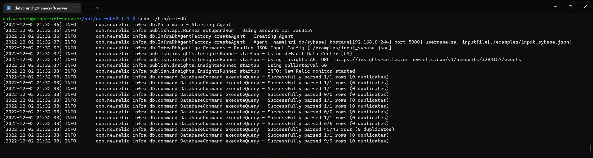
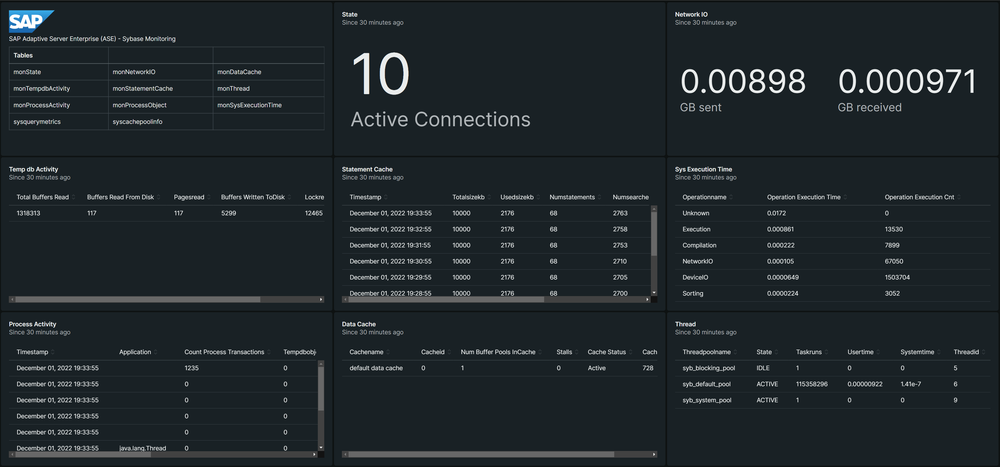

# Sybase
Sybase monitoring is still experimental and provided as-is.

## Prerequisites
1. Java 8
2. SAP Adaptive Server (ASE) Sybase JDBC connector `jconn4.jar`
3. New Relic Insights Insert Key: https://insights.newrelic.com/accounts/#######/manage/api_keys

## Permissions

Enable monitoring.  Note: Statement cache size may vary.
```
sp_configure "enable monitoring", 1
sp_configure "enable stmt cache monitoring", 1
sp_configure "execution time monitoring", 1
sp_configure "statement cache size", 100
```

Create a monitoring user and grant the `mon_role` to this monitoring user account.
```
use master
go
sp_addlogin newrelic, "NewRelic1!", master
sp_role "grant", mon_role, newrelic
grant select on master..sysquerymetrics to mon_role
go
```

If you already have a monitoring user, grant permissions
```
grant role mon_role to newrelic
grant select on master..sysquerymetrics to mon_role
```

## Setup
Start by downloading and installing `nri-db`

```
curl -OL https://github.com/newrelic-experimental/nri-db/releases/download/v.2.1.2/nri-db-2.1.2.tar
sudo tar -C /opt -xvf nri-db-2.1.2.tar
cd /opt/nri-db-2.1.2.tar
sudo cp plugin.example.json plugin.json
sudo ./bin/encrypt-password
```

Once the `.nridbrc` file is present in this application director, run this again to enter your password to encrypt:
```bash
sudo ./bin/encrypt-password
```

Copy the password output, it should be something like `ENC(WVZXyhoke0IGR48Y53jlu5qKgpDOfRA8)`.  We'll need this in the next step.

## Configure

Your file structure should like this:
```
.
├── bin
│   ├── encrypt-password
│   ├── encrypt-password.bat
│   ├── nri-db
│   └── nri-db.bat
├── config
│   ├── logging.properties
│   ├── plugin.json
│   └── plugin.sample.json
├── docker-compose.yml
├── Dockerfile
├── examples
│   ├── input_db2.json
│   ├── input_mssql.json
│   ├── input_mysql.json
│   ├── input_oracle.json
│   ├── input_postgres.json
│   └── input_sybase.json
├── helm
│   └── nri-db
│       ├── Chart.yaml
│       ├── templates
│       │   ├── configmap.yaml
│       │   ├── deployment.yaml
│       │   ├── encryption-password-secret.yaml
│       │   ├── _helpers.tpl
│       │   ├── inputs-configmap.yaml
│       │   └── serviceaccount.yaml
│       └── values.yaml
├── install
│   ├── nri-db.conf
│   └── nri-db.service
├── lib
│   ├── checker-qual-3.5.0.jar
│   ├── commons-codec-1.10.jar
│   ├── commons-lang3-3.12.0.jar
│   ├── commons-logging-1.2.jar
│   ├── gson-2.8.6.jar
│   ├── hsqldb-2.5.1.jar
│   ├── httpclient-4.5.6.jar
│   ├── httpcore-4.4.10.jar
│   ├── infra_publish-2.3.1.jar
│   ├── insights_client-1.0.9.jar
│   ├── jackson-annotations-2.6.0.jar
│   ├── jackson-core-2.6.7.jar
│   ├── jackson-databind-2.6.7.1.jar
│   ├── jasypt-1.9.3.jar
│   ├── jconn4.jar
│   ├── nri-db-2.1.2.jar
│   ├── postgresql-42.2.19.jar
│   ├── slf4j-api-1.7.30.jar
│   └── slf4j-jdk14-1.7.30.jar
├── logs
└── README.md
```

### config/plugin.json

Edit the `plugin.json` file using something like `sudo nano ./config/plugin.json` and replace with the your `account_id`, `insights_insert_key`, and encrypted `password` generated in the previous step.

```json
{
  "global": {
    "account_id": "#######",
    "insights_mode": {
      "insights_insert_key": "NRII-XXXXXXXXXXXXXXXXXXXXXXXXXXXXXXXXX"
    }
  },
  "agents": [
    {
      "name": "nri-db/sybase",
      "host": "192.168.0.244",
      "port": 5000,
      "username": "sa",
      "password": "ENC(WVZXyhoke0IGR48Y53jlu5qKgpDOfRA8)",
      "inputfile": "./examples/input_sybase.json",
      "useSsl": false,
      "static": {
        "tag": "value"
      }
    }
  ]
}
```

### lib/jconn4.jar

Copy the Sybase JDBC connector `jconn4.jar` to `/opt/nri-db-2.1.2/lib`.  You can typically find this file under `/opt/SAP/jConnect-16_0/classes/jconn4.jar`
```
sudo mv ./jconn4.jar /opt/nri-db-2.1.2/lib
```

### bin/nri-db

Edit `nri-db` and append `$APP_HOME/lib/jconn4.jar:` to the `CLASSPATH` so that it looks something like this:
```
CLASSPATH=$CLASSPATH:$APP_HOME/lib/jconn4.jar:$APP_HOME/lib/nri-db-2.1.2.jar
```

### examples/input_sybase.json

This file is case-sensitive.  The `SELECT * FROM` should all be in CAPITAL letters to work with the pre-built dashboards.

```
[
  {
    "query" : "SELECT * FROM monState",
    "name" : "Database",
    "type" : "metric",
    "database" : "master",
    "provider" : "SYBASE"
  },
  {
    "query" : "SELECT * FROM monNetworkIO",
    "name" : "Database",
    "type" : "metric",
    "database" : "master",
    "provider" : "SYBASE"
  },
  {
    "query" : "select * FROM monTempdbActivity",
    "name" : "Database",
    "type" : "metric",
    "database" : "master",
    "provider" : "SYBASE"
  },
  {
    "query" : "SELECT * FROM sysquerymetrics",
    "name" : "Database",
    "type" : "metric",
    "database" : "master",
    "provider" : "SYBASE"
  },
  {
    "query" : "SELECT * FROM monStatementCache",
    "name" : "Database",
    "type" : "metric",
    "database" : "master",
    "provider" : "SYBASE"
  },
  {
    "query" : "SELECT * FROM syscachepoolinfo",
    "name" : "Database",
    "type" : "metric",
    "database" : "master",
    "provider" : "SYBASE"
  },
  {
    "query" : "SELECT * FROM monLocks",
    "name" : "Database",
    "type" : "metric",
    "database" : "master",
    "provider" : "SYBASE"
  },
  {
    "query" : "SELECT * FROM monDataCache",
    "name" : "Database",
    "type" : "metric",
    "database" : "master",
    "provider" : "SYBASE"
  },
  {
    "query" : "SELECT * FROM monSysExecutionTime",
    "name" : "Database",
    "type" : "metric",
    "database" : "master",
    "provider" : "SYBASE"
  },
  {
    "query" : "SELECT * FROM monProcessActivity",
    "name" : "Database",
    "type" : "metric",
    "database" : "master",
    "provider" : "SYBASE"
  },
  {
    "query" : "SELECT * FROM monProcessObject",
    "name" : "Database",
    "type" : "metric",
    "database" : "master",
    "provider" : "SYBASE"
  },
  {
    "query" : "SELECT * FROM monThread",
    "name" : "Database",
    "type" : "metric",
    "database" : "master",
    "provider" : "SYBASE"
  }
]
```

## Run nri-db
This needs to be run inside `/opt/nri-db-2.1.2/` or else it fails to pick up the config files.  Use `nohup` to run in the background like this:

```
sudo nohup ./bin/nri-db &
```



## Stop nri-db
To stop the agent, find the `pid` and `kill` the process.
```
sudo ps aux | grep nri-db
sudo kill <pid>
```

## Dashboard



Import the following dashboard, besure to change `accountId: 0` to your own account number.

```json
{
  "name": "Sybase - SAP ASE",
  "description": null,
  "permissions": "PUBLIC_READ_WRITE",
  "pages": [
    {
      "name": "Sybase - SAP ASE",
      "description": null,
      "widgets": [
        {
          "title": "",
          "layout": {
            "column": 1,
            "row": 1,
            "width": 4,
            "height": 3
          },
          "linkedEntityGuids": null,
          "visualization": {
            "id": "viz.markdown"
          },
          "rawConfiguration": {
            "text": "  \nSAP Adaptive Server Enterprise (ASE) - Sybase Monitoring\n\n| Tables | | |\n| ---- | --- | --- |\n| monState | monNetworkIO | monDataCache |\n| monTempdbActivity | monStatementCache | monThread | \n| monProcessActivity | monProcessObject | monSysExecutionTime |\n| sysquerymetrics | syscachepoolinfo |  |"
          }
        },
        {
          "title": "State",
          "layout": {
            "column": 5,
            "row": 1,
            "width": 4,
            "height": 3
          },
          "linkedEntityGuids": null,
          "visualization": {
            "id": "viz.billboard"
          },
          "rawConfiguration": {
            "facet": {
              "showOtherSeries": false
            },
            "nrqlQueries": [
              {
                "accountId": 0,
                "query": "SELECT latest(connections) as 'Active Connections' FROM SYBASE WHERE query='SELECT * FROM monState'"
              }
            ],
            "platformOptions": {
              "ignoreTimeRange": false
            }
          }
        },
        {
          "title": "Network IO",
          "layout": {
            "column": 9,
            "row": 1,
            "width": 4,
            "height": 3
          },
          "linkedEntityGuids": null,
          "visualization": {
            "id": "viz.billboard"
          },
          "rawConfiguration": {
            "facet": {
              "showOtherSeries": false
            },
            "nrqlQueries": [
              {
                "accountId": 0,
                "query": "SELECT latest(bytessent)/10e8 as 'GB sent', latest(bytesreceived)/10e8 as 'GB received' FROM SYBASE WHERE query='SELECT * FROM monNetworkIO'"
              }
            ],
            "platformOptions": {
              "ignoreTimeRange": false
            }
          }
        },
        {
          "title": "Temp db Activity",
          "layout": {
            "column": 1,
            "row": 4,
            "width": 4,
            "height": 3
          },
          "linkedEntityGuids": null,
          "visualization": {
            "id": "viz.table"
          },
          "rawConfiguration": {
            "facet": {
              "showOtherSeries": false
            },
            "nrqlQueries": [
              {
                "accountId": 0,
                "query": "SELECT latest(logicalreads) as 'TotalBuffersRead', latest(physicalreads) as 'BuffersReadFromDisk', latest(pagesread), latest(physicalwrites) as 'BuffersWrittenToDisk', latest(lockrequests), latest(lockwaits) FROM SYBASE WHERE query='SELECT * FROM monTempdbActivity'"
              }
            ],
            "platformOptions": {
              "ignoreTimeRange": false
            }
          }
        },
        {
          "title": "Statement Cache",
          "layout": {
            "column": 5,
            "row": 4,
            "width": 4,
            "height": 3
          },
          "linkedEntityGuids": null,
          "visualization": {
            "id": "viz.table"
          },
          "rawConfiguration": {
            "facet": {
              "showOtherSeries": false
            },
            "nrqlQueries": [
              {
                "accountId": 0,
                "query": "SELECT totalsizekb, usedsizekb, numstatements, numsearches, hitcount, numinserts, numremovals FROM SYBASE WHERE query='SELECT * FROM monStatementCache'"
              }
            ],
            "platformOptions": {
              "ignoreTimeRange": false
            }
          }
        },
        {
          "title": "Sys Execution Time",
          "layout": {
            "column": 9,
            "row": 4,
            "width": 4,
            "height": 3
          },
          "linkedEntityGuids": null,
          "visualization": {
            "id": "viz.table"
          },
          "rawConfiguration": {
            "facet": {
              "showOtherSeries": false
            },
            "nrqlQueries": [
              {
                "accountId": 0,
                "query": "SELECT latest(executiontime)/10e9 as 'OperationExecutionTime', latest(executioncnt) as 'OperationExecutionCnt' FROM SYBASE WHERE query='SELECT * FROM monSysExecutionTime' FACET operationname"
              }
            ],
            "platformOptions": {
              "ignoreTimeRange": false
            }
          }
        },
        {
          "title": "Process Activity",
          "layout": {
            "column": 1,
            "row": 7,
            "width": 4,
            "height": 3
          },
          "linkedEntityGuids": null,
          "visualization": {
            "id": "viz.table"
          },
          "rawConfiguration": {
            "facet": {
              "showOtherSeries": false
            },
            "nrqlQueries": [
              {
                "accountId": 0,
                "query": "SELECT application, transactions as 'CountProcessTransactions', tempdbobjects, tableaccesses, indexaccesses, locksheld, cputime, waittime, commits, rollbacks FROM SYBASE WHERE query='SELECT * FROM monProcessActivity'"
              }
            ],
            "platformOptions": {
              "ignoreTimeRange": false
            }
          }
        },
        {
          "title": "Data Cache",
          "layout": {
            "column": 5,
            "row": 7,
            "width": 4,
            "height": 3
          },
          "linkedEntityGuids": null,
          "visualization": {
            "id": "viz.table"
          },
          "rawConfiguration": {
            "facet": {
              "showOtherSeries": false
            },
            "nrqlQueries": [
              {
                "accountId": 0,
                "query": "SELECT latest(cacheid), latest(bufferpools) as 'NumBufferPoolsInCache', latest(stalls), latest(status) as 'CacheStatus', latest(overhead) as 'CacheOverhead' FROM SYBASE WHERE query='SELECT * FROM monDataCache' FACET cachename"
              }
            ],
            "platformOptions": {
              "ignoreTimeRange": false
            }
          }
        },
        {
          "title": "Thread",
          "layout": {
            "column": 9,
            "row": 7,
            "width": 4,
            "height": 3
          },
          "linkedEntityGuids": null,
          "visualization": {
            "id": "viz.table"
          },
          "rawConfiguration": {
            "facet": {
              "showOtherSeries": false
            },
            "nrqlQueries": [
              {
                "accountId": 0,
                "query": "SELECT latest(state), latest(taskruns), latest(usertime)/10e9, latest(systemtime)/10e9, latest(threadid) FROM SYBASE WHERE query='SELECT * FROM monThread' FACET threadpoolname"
              }
            ],
            "platformOptions": {
              "ignoreTimeRange": false
            }
          }
        },
        {
          "title": "ProcessObject",
          "layout": {
            "column": 1,
            "row": 10,
            "width": 4,
            "height": 3
          },
          "linkedEntityGuids": null,
          "visualization": {
            "id": "viz.table"
          },
          "rawConfiguration": {
            "facet": {
              "showOtherSeries": false
            },
            "nrqlQueries": [
              {
                "accountId": 0,
                "query": "SELECT latest(logicalreads), latest(physicalreads), latest(objecttype) FROM SYBASE WHERE query='SELECT * FROM monProcessObject' FACET dbname, objectName"
              }
            ],
            "platformOptions": {
              "ignoreTimeRange": false
            }
          }
        },
        {
          "title": "Locks",
          "layout": {
            "column": 5,
            "row": 10,
            "width": 4,
            "height": 3
          },
          "linkedEntityGuids": null,
          "visualization": {
            "id": "viz.table"
          },
          "rawConfiguration": {
            "facet": {
              "showOtherSeries": false
            },
            "nrqlQueries": [
              {
                "accountId": 0,
                "query": "SELECT lockstate, locktype, locklevel, pagelevel, rownumber, dbname as 'LockedDBName' FROM SYBASE WHERE query='SELECT * FROM monLocks'"
              }
            ],
            "platformOptions": {
              "ignoreTimeRange": false
            }
          }
        },
        {
          "title": "sysquerymetrics",
          "layout": {
            "column": 9,
            "row": 10,
            "width": 4,
            "height": 3
          },
          "linkedEntityGuids": null,
          "visualization": {
            "id": "viz.table"
          },
          "rawConfiguration": {
            "facet": {
              "showOtherSeries": false
            },
            "nrqlQueries": [
              {
                "accountId": 0,
                "query": "SELECT qtext as 'QueryText', cnt as 'QCount', exec_avg as 'AvgExecutionTime', elap_avg as 'AvgElapsedTime', lio_avg as 'AvgLogicalIO', pio_avg as 'AvgPhysicalIO' FROM SYBASE WHERE query='SELECT * FROM sysquerymetrics'"
              }
            ],
            "platformOptions": {
              "ignoreTimeRange": false
            }
          }
        }
      ]
    },
    {
      "name": "State",
      "description": null,
      "widgets": [
        {
          "title": "monState",
          "layout": {
            "column": 1,
            "row": 1,
            "width": 12,
            "height": 10
          },
          "linkedEntityGuids": null,
          "visualization": {
            "id": "viz.table"
          },
          "rawConfiguration": {
            "facet": {
              "showOtherSeries": false
            },
            "nrqlQueries": [
              {
                "accountId": 0,
                "query": "SELECT * FROM SYBASE WHERE query ='SELECT * FROM monState'"
              }
            ],
            "platformOptions": {
              "ignoreTimeRange": false
            }
          }
        }
      ]
    },
    {
      "name": "NetworkIO",
      "description": null,
      "widgets": [
        {
          "title": "monNetworkIO",
          "layout": {
            "column": 1,
            "row": 1,
            "width": 12,
            "height": 10
          },
          "linkedEntityGuids": null,
          "visualization": {
            "id": "viz.table"
          },
          "rawConfiguration": {
            "facet": {
              "showOtherSeries": false
            },
            "nrqlQueries": [
              {
                "accountId": 0,
                "query": "SELECT * FROM SYBASE WHERE query ='SELECT * FROM monNetworkIO'"
              }
            ],
            "platformOptions": {
              "ignoreTimeRange": false
            }
          }
        }
      ]
    },
    {
      "name": "TempdbActivity",
      "description": null,
      "widgets": [
        {
          "title": "monTempdbActivity",
          "layout": {
            "column": 1,
            "row": 1,
            "width": 12,
            "height": 10
          },
          "linkedEntityGuids": null,
          "visualization": {
            "id": "viz.table"
          },
          "rawConfiguration": {
            "facet": {
              "showOtherSeries": false
            },
            "nrqlQueries": [
              {
                "accountId": 0,
                "query": "SELECT * FROM SYBASE WHERE query ='SELECT * FROM monTempdbActivity'"
              }
            ],
            "platformOptions": {
              "ignoreTimeRange": false
            }
          }
        }
      ]
    },
    {
      "name": "sysquerymetrics",
      "description": null,
      "widgets": [
        {
          "title": "sysquerymetrics",
          "layout": {
            "column": 1,
            "row": 1,
            "width": 12,
            "height": 10
          },
          "linkedEntityGuids": null,
          "visualization": {
            "id": "viz.table"
          },
          "rawConfiguration": {
            "facet": {
              "showOtherSeries": false
            },
            "nrqlQueries": [
              {
                "accountId": 0,
                "query": "SELECT * FROM SYBASE WHERE query='SELECT * FROM sysquerymetrics'"
              }
            ],
            "platformOptions": {
              "ignoreTimeRange": false
            }
          }
        }
      ]
    },
    {
      "name": "StatementCache",
      "description": null,
      "widgets": [
        {
          "title": "monStatementCache",
          "layout": {
            "column": 1,
            "row": 1,
            "width": 12,
            "height": 10
          },
          "linkedEntityGuids": null,
          "visualization": {
            "id": "viz.table"
          },
          "rawConfiguration": {
            "facet": {
              "showOtherSeries": false
            },
            "nrqlQueries": [
              {
                "accountId": 0,
                "query": "SELECT * FROM SYBASE WHERE query='SELECT * FROM monStatementCache'"
              }
            ],
            "platformOptions": {
              "ignoreTimeRange": false
            }
          }
        }
      ]
    },
    {
      "name": "syscachepoolinfo",
      "description": null,
      "widgets": [
        {
          "title": "syscachepoolinfo",
          "layout": {
            "column": 1,
            "row": 1,
            "width": 12,
            "height": 10
          },
          "linkedEntityGuids": null,
          "visualization": {
            "id": "viz.table"
          },
          "rawConfiguration": {
            "facet": {
              "showOtherSeries": false
            },
            "nrqlQueries": [
              {
                "accountId": 0,
                "query": "SELECT * FROM SYBASE WHERE query='SELECT * FROM syscachepoolinfo'"
              }
            ],
            "platformOptions": {
              "ignoreTimeRange": false
            }
          }
        }
      ]
    },
    {
      "name": "Locks",
      "description": null,
      "widgets": [
        {
          "title": "monLocks",
          "layout": {
            "column": 1,
            "row": 1,
            "width": 12,
            "height": 10
          },
          "linkedEntityGuids": null,
          "visualization": {
            "id": "viz.table"
          },
          "rawConfiguration": {
            "facet": {
              "showOtherSeries": false
            },
            "nrqlQueries": [
              {
                "accountId": 0,
                "query": "SELECT * FROM SYBASE WHERE query='SELECT * FROM monLocks'"
              }
            ],
            "platformOptions": {
              "ignoreTimeRange": false
            }
          }
        }
      ]
    },
    {
      "name": "DataCache",
      "description": null,
      "widgets": [
        {
          "title": "monDataCache",
          "layout": {
            "column": 1,
            "row": 1,
            "width": 12,
            "height": 10
          },
          "linkedEntityGuids": null,
          "visualization": {
            "id": "viz.table"
          },
          "rawConfiguration": {
            "facet": {
              "showOtherSeries": false
            },
            "nrqlQueries": [
              {
                "accountId": 0,
                "query": "SELECT * FROM SYBASE WHERE query='SELECT * FROM monDataCache'"
              }
            ],
            "platformOptions": {
              "ignoreTimeRange": false
            }
          }
        }
      ]
    },
    {
      "name": "SysExecutionTime",
      "description": null,
      "widgets": [
        {
          "title": "monSysExecutionTime",
          "layout": {
            "column": 1,
            "row": 1,
            "width": 12,
            "height": 10
          },
          "linkedEntityGuids": null,
          "visualization": {
            "id": "viz.table"
          },
          "rawConfiguration": {
            "facet": {
              "showOtherSeries": false
            },
            "nrqlQueries": [
              {
                "accountId": 0,
                "query": "SELECT * FROM SYBASE WHERE query='SELECT * FROM monSysExecutionTime'"
              }
            ],
            "platformOptions": {
              "ignoreTimeRange": false
            }
          }
        }
      ]
    },
    {
      "name": "ProcessActivity",
      "description": null,
      "widgets": [
        {
          "title": "monProcessActivity",
          "layout": {
            "column": 1,
            "row": 1,
            "width": 12,
            "height": 10
          },
          "linkedEntityGuids": null,
          "visualization": {
            "id": "viz.table"
          },
          "rawConfiguration": {
            "facet": {
              "showOtherSeries": false
            },
            "nrqlQueries": [
              {
                "accountId": 0,
                "query": "SELECT * FROM SYBASE WHERE query='SELECT * FROM monProcessActivity'"
              }
            ],
            "platformOptions": {
              "ignoreTimeRange": false
            }
          }
        }
      ]
    },
    {
      "name": "ProcessObject",
      "description": null,
      "widgets": [
        {
          "title": "monProcessObject",
          "layout": {
            "column": 1,
            "row": 1,
            "width": 12,
            "height": 10
          },
          "linkedEntityGuids": null,
          "visualization": {
            "id": "viz.table"
          },
          "rawConfiguration": {
            "facet": {
              "showOtherSeries": false
            },
            "nrqlQueries": [
              {
                "accountId": 0,
                "query": "SELECT * FROM SYBASE WHERE query='SELECT * FROM monProcessObject'"
              }
            ],
            "platformOptions": {
              "ignoreTimeRange": false
            }
          }
        }
      ]
    },
    {
      "name": "Thread",
      "description": null,
      "widgets": [
        {
          "title": "monThread",
          "layout": {
            "column": 1,
            "row": 1,
            "width": 12,
            "height": 10
          },
          "linkedEntityGuids": null,
          "visualization": {
            "id": "viz.table"
          },
          "rawConfiguration": {
            "facet": {
              "showOtherSeries": false
            },
            "nrqlQueries": [
              {
                "accountId": 0,
                "query": "SELECT * FROM SYBASE WHERE query='SELECT * FROM monThread'"
              }
            ],
            "platformOptions": {
              "ignoreTimeRange": false
            }
          }
        }
      ]
    }
  ],
  "variables": []
}
```